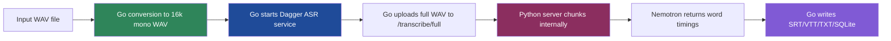

# Live Transcription Architecture, Design, and Implementation Guide

This document explains, in detail, how the current `transcription-go` system works, why it is not yet a live transcription system even though it already has the most important building blocks, and what the correct long-term production architecture should be. It is written for a new intern who has not lived through the current debugging and implementation history and therefore needs both orientation and direction.

The key conclusion is straightforward: the repository should **not** try to fake live transcription by repeatedly abusing the existing `/transcribe/full` API. That API is correct for batch mode and should remain so. The correct long-term path is a **session-oriented streaming transcription service** with stable incremental results, a dedicated live client in Go, and a result-merging/finalization layer that separates *partial* hypotheses from *final* committed transcript output. However, because that path is more complex, the recommended implementation plan is phased: first refactor the service boundary, then add a chunk-oriented near-live mode to prove the product behavior, and finally converge on a real streaming API that is suitable for production use.

---

## 1. Executive Summary

The current repository already proves five essential things:

1. the Go CLI can prepare audio without host `ffmpeg` (`internal/convert/convert.go:14-109`),
2. the Python ASR model can be kept warm behind a Dagger-managed service (`internal/server/dagger.go:27-91`),
3. the Go side can reach that service reliably through a host tunnel (`internal/server/dagger.go:63-89`),
4. the server can return word-level timestamps (`server/server.py:58-161`),
5. the Go side can turn those words into durable output formats such as SRT and SQLite (`cmd/transcribe/main.go:146-208`, `internal/output/format.go:16-109`, `internal/output/sqlite.go:10-145`).

Those are exactly the foundations a live transcription system needs. The missing pieces are not “make ASR possible”; they are “change the request/response model”, “introduce session state”, “separate partial from final transcript state”, and “define the audio-ingestion boundary clearly”.

### Recommendation

The **correct long-term production solution** is:

- keep the current batch pipeline intact,
- evolve the Python service into a **session-oriented live transcription service**,
- expose a **streaming transport** (WebSocket) for audio ingress and result egress,
- add a **Go live client** with source abstraction, session management, and transcript finalization,
- treat chunked near-live transcription only as an **intermediate proving phase**, not the final architecture.

### Why that is the right answer

A live transcription system needs to answer questions that batch mode does not:

- Which words are tentative and may still change?
- Which words are final and can safely be written to the user-visible transcript?
- How do we preserve decoder state across time instead of re-decoding every chunk as an isolated file?
- How do we keep latency low without creating duplicate/broken results at chunk boundaries?
- How do we reconnect or restart safely if the service or client fails mid-stream?

A real streaming/session design answers those questions directly. A repeated stateless “upload another WAV chunk” design only approximates them.

---

## 2. Problem Statement and Scope

## 2.1 Problem

The user asked whether this setup can do live transcription. The answer is “yes, but not with the current API shape”. The current system is batch-oriented by design.

Evidence:

- the CLI is built around a single `--input` file and a single synchronous `run(...)` call (`cmd/transcribe/main.go:31-57`, `cmd/transcribe/main.go:64-138`),
- the ASR client only exposes `TranscribeFull(...)`, which uploads the entire file in one multipart request (`internal/asr/client.go:63-115`),
- the Python server only exposes `POST /transcribe/full`, and then performs internal chunking after receiving the full file (`server/server.py:58-108`),
- the output stage assumes that all words exist before any writing begins (`cmd/transcribe/main.go:140-208`).

That means the current system can transcribe long recordings quickly and reliably, but it cannot yet:

- accept an ongoing audio stream,
- emit partial/live results,
- incrementally commit words,
- differentiate “tentative” from “final” transcript state.

## 2.2 Scope

### In scope

This ticket covers the architecture and implementation plan for:

- adding live transcription to this repository,
- preserving the current batch path,
- introducing the correct transport/session boundaries,
- specifying the intermediate near-live proving phase,
- specifying the long-term production-grade streaming design,
- giving file-level implementation guidance for a new engineer.

### Out of scope

This ticket does **not** implement:

- GPU acceleration,
- diarization / speaker separation,
- final UI decisions for a rich live transcript viewer,
- deployment to multi-tenant remote infrastructure.

Those may matter later, but the current design problem is first about service shape, protocol shape, and transcript state management.

---

## 3. Current-State Architecture (Evidence-Based)

A new engineer should understand the current system as a four-stage batch pipeline.



## 3.1 Batch CLI orchestration

The top-level control flow is in `cmd/transcribe/main.go`.

Observed behavior:

- Cobra CLI requires a single `--input` file (`cmd/transcribe/main.go:31-48`)
- batch run converts input to `out/audio_16k_mono.wav` (`cmd/transcribe/main.go:83-89`)
- starts the ASR server (`cmd/transcribe/main.go:91-101`)
- sends a full transcription request (`cmd/transcribe/main.go:103-138`)
- waits until all words are returned,
- then writes final outputs (`cmd/transcribe/main.go:146-208`)

That is important because it shows the current CLI is fundamentally **request/response batch orchestration**, not a live event loop.

## 3.2 Dagger runtime boundary

The Dagger service lifecycle in `internal/server/dagger.go` is one of the strongest foundations for live mode.

Observed behavior:

- connects to Dagger (`internal/server/dagger.go:34-37`)
- mounts persistent pip and HuggingFace caches (`internal/server/dagger.go:39-40`, `47-49`)
- stages the Python server into `/app` and installs requirements (`internal/server/dagger.go:42-53`)
- converts the container into a service with `AsService(...Args...)` (`internal/server/dagger.go:55-61`)
- creates and starts a host tunnel (`internal/server/dagger.go:63-70`)
- resolves the tunnel endpoint (`internal/server/dagger.go:72-76`)
- waits for HTTP health (`internal/server/dagger.go:84-116`)

This means the repository already has the hardest operational piece for live transcription: a long-running, warm model server with a reliable local endpoint.

## 3.3 ASR client boundary

The current Go client in `internal/asr/client.go` is intentionally simple, but its simplicity also defines the current limitation.

Observed behavior:

- one data model: `TranscribeResponse` with `Words`, `TotalDuration`, `ChunkCount`, `WordCount` (`internal/asr/client.go:23-29`)
- one network behavior: `TranscribeFull(...)` (`internal/asr/client.go:63-115`)
- one request style: build full multipart body in memory and upload it (`internal/asr/client.go:72-96`)
- one response style: decode a final complete JSON document (`internal/asr/client.go:104-114`)

This is the contract of an offline job, not a live transport.

## 3.4 Python server boundary

The current FastAPI server in `server/server.py` has exactly two endpoints:

- `GET /health` (`server/server.py:53-55`)
- `POST /transcribe/full` (`server/server.py:58-108`)

Observed behavior:

- model loads once in `lifespan(...)` (`server/server.py:24-47`)
- model is configured for timestamps (`server/server.py:36-44`)
- full uploaded WAV is written to a temporary file (`server/server.py:70-74`)
- server loops over 60-second windows plus 2-second overlap (`server/server.py:80-98`)
- each chunk is extracted with `ffmpeg` inside the container (`server/server.py:83-93`)
- words are returned only after the *entire* request has completed (`server/server.py:101-106`)

The server is already chunk-aware internally, but not session-aware externally.

## 3.5 Output layer

The output layer is already architecturally separate from inference.

Observed behavior:

- subtitle grouping happens in Go (`internal/output/format.go:16-69`)
- SRT/VTT/TXT formatting happens in Go (`internal/output/format.go:72-109`)
- SQLite storage happens in Go (`internal/output/sqlite.go:10-145`)

This separation is extremely useful. It means live mode can evolve transcript-state semantics without rewriting the actual final output code from scratch.

---

## 4. Gap Analysis: What Live Transcription Needs That Batch Mode Does Not

A live system is not just “call the server more often”. It requires new architectural concepts.

### 4.1 Missing concept: session identity

Current batch mode is stateless from the server’s point of view. Each request is independent.

Live mode requires:

- a stream/session identifier,
- service-side state associated with that session,
- explicit start/finalize/abort semantics.

### 4.2 Missing concept: partial vs final transcript state

Batch mode only deals with final words.

Live mode requires at least two result states:

- **partial**: useful for user feedback, but may change,
- **final**: safe to persist, subtitle, or display as committed text.

Without this split, the client either flickers constantly or commits incorrect words too early.

### 4.3 Missing concept: rolling audio ingestion

Current mode uploads a complete WAV file in one request. That is simple and correct for batch, but live mode needs one of:

- chunk uploads with explicit timing metadata,
- or a persistent streaming connection that continuously carries PCM/audio frames.

### 4.4 Missing concept: transcript merge/finalization logic

Current mode receives a completed word list once.

Live mode needs:

- result deduplication,
- boundary handling,
- monotonic finalization rules,
- optional replay/recovery semantics.

### 4.5 Missing concept: source abstraction

Current mode assumes a file on disk.

Live mode may need audio from:

- a chunk directory written by another recorder,
- stdin / named pipe,
- a direct capture source,
- a future remote source.

The correct solution should not hard-code exactly one input source forever.

---

## 5. Alternatives Considered

## 5.1 Alternative A: reuse `/transcribe/full` repeatedly

### Description

Take small rolling WAV files on the client and repeatedly call the current full-file endpoint.

### Why it is appealing

- requires almost no server refactoring,
- uses the already working service,
- fastest path to seeing text appear while audio is still being recorded.

### Why it is not the correct long-term solution

- no session concept,
- no partial/final semantics,
- repeated decode on overlapping windows,
- awkward duplication/deduplication behavior,
- no clean backpressure or stream lifecycle,
- poor foundation for production UX.

### Verdict

Not recommended as the final design. Useful only as a short-lived internal experiment.

## 5.2 Alternative B: chunked near-live HTTP API

### Description

Add a new chunk endpoint, for example `POST /transcribe/chunk`, and send small WAV chunks with timing metadata. Keep the client responsible for overlap and merging.

### Why it is good

- much easier than full streaming,
- keeps the server model warm,
- simple to reason about,
- sufficient to prove UX and latency,
- works well as an intermediate implementation phase.

### Why it is insufficient for final production use

- still fundamentally stateless or only weakly stateful,
- chunk boundaries still require overlap heuristics,
- partial results are clumsy,
- decoder state is not preserved as cleanly as a true stream.

### Verdict

Recommended as **Phase 1 / proving path**, but not the final architecture.

## 5.3 Alternative C: true session-oriented streaming API over WebSocket

### Description

Create a long-lived per-session connection. Send continuous audio frames. Emit partial and final results over the same channel. Maintain explicit server-side session state.

### Why it is the correct long-term solution

- best latency model,
- best fit for partial/final transcript semantics,
- clean session lifecycle,
- clean production foundation,
- naturally supports control events and richer telemetry.

### Costs

- more server complexity,
- more protocol design,
- more client state management,
- more implementation work.

### Verdict

This is the recommended **production architecture**.

---

## 6. Proposed Architecture

The proposed architecture has two intentionally distinct operating modes.

1. **Batch mode** (existing path, retained)
2. **Live mode** (new path, session-oriented)

### 6.1 Principle

Do not replace batch mode with live mode. Build a live mode beside it.

That keeps:

- current successful behavior intact,
- current docs/test expectations stable,
- production experimentation safer,
- future performance comparisons easier.

## 6.2 High-level architecture

```mermaid
flowchart TD
    subgraph Client[        A[AudioSource abstraction]
        B[Live session manager]
        C[Transport client\nHTTP chunk mode or WebSocket stream]
        D[Transcript accumulator\npartial vs final]
        E[Rolling sinks\nconsole/SRT/SQLite]
    end

    subgraph Service[Python ASR service]
        F[Session registry]
        G[Audio ingress API]
        H[Streaming decoder / chunk decoder]
        I[Result emitter]
    end

    subgraph Batch[Existing batch path]
        J[POST /transcribe/full]
    end

    A --> B --> C
    C --> G
    G --> F --> H --> I
    I --> C
    C --> D --> E
    J --> H

    style B fill:#1f4b99,color:#fff
    style D fill:#2f855a,color:#fff
    style F fill:#805ad5,color:#fff
    style H fill:#8b2e5f,color:#fff
```

### 6.3 Architectural rule

The live system should be designed around a clear separation of responsibilities.

| Layer | Responsibility | Should know about |
|------|----------------|-------------------|
| Audio source | produce timestamped audio chunks or frames | input device / upstream recorder only |
| Live client transport | send audio, receive events | protocol details |
| Transcript accumulator | merge partial/final results into a coherent transcript | result semantics only |
| Output sinks | render or persist transcript | finalized transcript state |
| ASR service session layer | manage live session lifecycle | sessions, buffering, decoder state |
| Decoder engine | transform audio to text | model/runtime specifics |

That separation is what makes the system understandable for an intern and evolvable for production use.

---

## 7. Recommended API Design

The repository should ultimately support **two live-facing APIs**:

1. a simpler chunk API for Phase 1,
2. a production streaming API for the final design.

## 7.1 Phase 1 API: chunk-based near-live mode

### Endpoint

```text
POST /transcribe/chunk
```

### Request

Multipart form or JSON+binary, but multipart is fine initially.

Fields:

- `file`: WAV chunk, already 16k mono preferred
- `session_id`: string
- `chunk_index`: integer
- `chunk_start`: float seconds
- `is_final_chunk`: bool (optional)
- `overlap_seconds`: float (optional)

### Response

```json
{
  "session_id": "abc123",
  "chunk_index": 17,
  "chunk_start": 34.0,
  "chunk_duration": 2.0,
  "words": [
    {"word": "hello", "start": 34.22, "end": 34.51},
    {"word": "world", "start": 34.52, "end": 34.90}
  ],
  "partial": false,
  "processing_ms": 187
}
```

### Notes

This API is intentionally simple and stateless-ish. It is enough to test:

- whether live capture feels good,
- whether the model is fast enough,
- whether the overlap and dedupe policy is acceptable,
- whether rolling subtitle output is useful.

## 7.2 Final API: session-oriented streaming WebSocket

### Endpoint

```text
WS /transcribe/stream
```

### Client → server messages

#### Start session

```json
{
  "type": "start",
  "session_id": "abc123",
  "sample_rate": 16000,
  "channels": 1,
  "format": "pcm_s16le",
  "source": "chunk-dir|stdin|mic|system-audio"
}
```

#### Audio frame

```json
{
  "type": "audio",
  "sequence": 42,
  "pts": 84.000,
  "duration": 0.500,
  "pcm16_base64": "..."
}
```

#### Flush

```json
{"type": "flush"}
```

#### Stop

```json
{"type": "stop"}
```

### Server → client messages

#### Session accepted

```json
{
  "type": "started",
  "session_id": "abc123"
}
```

#### Partial transcript event

```json
{
  "type": "partial",
  "session_id": "abc123",
  "sequence": 42,
  "text": "hello wor",
  "words": [
    {"word": "hello", "start": 84.22, "end": 84.51}
  ]
}
```

#### Finalized words event

```json
{
  "type": "final_words",
  "session_id": "abc123",
  "up_to_time": 84.90,
  "words": [
    {"word": "hello", "start": 84.22, "end": 84.51},
    {"word": "world", "start": 84.52, "end": 84.90}
  ]
}
```

#### Session summary

```json
{
  "type": "stopped",
  "session_id": "abc123",
  "word_count": 927,
  "duration": 302.4
}
```

### Why this API shape is recommended

It explicitly separates:

- control plane (`start`, `flush`, `stop`),
- media plane (`audio`),
- result plane (`partial`, `final_words`, `stopped`).

That gives the Go client enough structure to build a stable user-facing transcript.

---

## 8. Transcript State Model

A live transcript cannot just be “append every word the server gives you”. It needs a proper state model.

## 8.1 Terminology

### Partial words

Words or text fragments that may still change as more context arrives.

### Final words

Words that the decoder/server guarantees will no longer be revised.

### Committed transcript

Words that the client has accepted as stable and may safely:

- write to rolling SRT,
- store in SQLite,
- print as durable transcript output.

## 8.2 Recommended Go-side structures

```go
type LiveWord struct {
    Word      string
    Start     float64
    End       float64
    Confidence *float64
    Final     bool
    SourceSeq int
}

type TranscriptAccumulator struct {
    committed []LiveWord
    pending   []LiveWord
    lastFinalTime float64
}
```

## 8.3 Accumulator rules

1. Never rewrite `committed` words.
2. Replace or recompute `pending` words whenever a new partial event arrives.
3. Move words from `pending` to `committed` only when the server marks them final (or, in Phase 1, when client heuristics deem them stable enough).
4. Ensure committed word times are monotonic.
5. Write persistent outputs from committed state only.

### Pseudocode

```text
on event(partial):
    pending = normalize(partial.words)
    render(committed + pending_preview)

on event(final_words):
    for each word in event.words:
        if word.end > lastFinalTime:
            committed.append(word)
            lastFinalTime = word.end
    pending = drop_words_before(lastFinalTime, pending)
    update_live_outputs(committed)
```

This accumulator is one of the core architectural pieces. It should be written clearly and tested carefully.

---

## 9. Audio Ingestion Strategy

The design should support multiple sources without locking the project into direct OS audio capture on day 1.

## 9.1 Recommended source abstraction

```go
type AudioChunk struct {
    SessionID string
    Sequence  int
    Start     float64
    Duration  float64
    PCM16     []byte
}

type AudioSource interface {
    Run(ctx context.Context, out chan<- AudioChunk) error
}
```

## 9.2 Initial source implementations

### Source A: chunk-directory watcher (recommended first)

Use when another recorder already writes chunk WAV files.

Why it is a good first source:

- simplest integration path,
- no OS-specific audio capture complexity,
- easy to debug and replay,
- aligns well with current screencast workflows.

### Source B: stdin / named pipe PCM source

Useful for shell pipelines and testing.

### Source C: direct mic/system audio capture

Desirable long-term for some UX flows, but should not be the first implementation in this repo because it introduces cross-platform capture complexity unrelated to the transcript protocol problem.

## 9.3 Why not start with direct system capture

Because the hard design problem here is not “how do we talk to ALSA/Pulse/CoreAudio?” It is:

- how do we model live transcript state,
- how do we structure the service protocol,
- how do we finalize words cleanly.

Direct capture can come later, once the live transcript pipeline is solid.

---

## 10. Detailed File-Level Implementation Plan

This section is written deliberately for a new engineer who wants to know exactly where code should go.

## Phase 0: preserve batch mode and refactor for coexistence

### Goal

Keep the existing working batch pipeline intact while making room for live mode.

### Files

- `cmd/transcribe/main.go`
- `internal/asr/client.go`
- `server/server.py`

### Tasks

1. Split the CLI into explicit subcommands or mode handlers:
   - `transcribe batch`
   - `transcribe live`
2. Keep the current `batch` behavior unchanged.
3. Move shared server startup/client construction into helpers.

### Pseudocode

```text
root transcribe
    batch -> current pipeline
    live  -> new live pipeline
```

### Why this phase matters

It avoids destabilizing the only working transcription path while the live path is still experimental.

## Phase 1: add chunk-oriented near-live mode

### Goal

Prove that live-ish transcription is ergonomically and computationally viable.

### Python server changes

#### `server/server.py`

Add:

- `POST /transcribe/chunk`
- helper to transcribe a single chunk without full-file chunking
- optional `session_id` passthrough in logs/response

Refactor existing logic so `_extract_words(...)` remains shared.

Potential helper extraction:

```python
def transcribe_wav_chunk(chunk_path: str, chunk_start: float) -> list[dict]:
    hypotheses = asr_model.transcribe([chunk_path], return_hypotheses=True, batch_size=1)
    return _extract_words(hypotheses, chunk_start)
```

### Go client changes

#### `internal/asr/client.go`

Add:

- `type ChunkResponse ...`
- `func (c *Client) TranscribeChunk(...)`

Important note: unlike `TranscribeFull`, chunk upload should avoid large in-memory request assembly where possible. Streaming multipart is preferable, though not strictly required in the first step because chunks are small.

### Go live package

Create a new package, for example:

- `internal/live/`

Files to add:

- `source.go` — source interface and chunk struct
- `watcher.go` — chunk-directory watcher source
- `accumulator.go` — merge/finalization logic
- `runner.go` — end-to-end live loop
- `writer.go` — rolling output sink behavior

### CLI changes

#### `cmd/transcribe/main.go`

Add flags for:

- `transcribe live --chunk-dir ...`
- `--session-id`
- `--live-format srt,txt,console,db`
- `--overlap-seconds`

### Success criteria

- process sequential chunk files as they appear,
- output rolling transcript text,
- produce usable rolling subtitles,
- demonstrate acceptable latency.

## Phase 2: formalize transcript accumulator and persistence semantics

### Goal

Make live output reliable and understandable before introducing WebSockets.

### Files

- `internal/live/accumulator.go`
- `internal/output/sqlite.go`
- possibly new `internal/output/live_sqlite.go`

### Tasks

1. Introduce explicit `pending` vs `committed` state.
2. Add rolling persistence behavior:
   - write only committed words to SQLite,
   - optionally keep pending words in memory only.
3. Add rolling SRT writer that updates only finalized segments.

### Important design choice

Do **not** shoehorn pending state into the current final-only SQLite schema without a clear need. If live persistence needs pending rows, add a separate table or explicit status field rather than overloading semantics invisibly.

## Phase 3: introduce true streaming session API (production path)

### Goal

Replace chunk-loop transport with a proper long-lived streaming session.

### Python server changes

#### `server/server.py`

Add:

- WebSocket endpoint
- in-memory session registry
- session object with audio buffer + decoder state
- partial/final event emission

Potential module split if the file becomes too large:

- `server/server.py` — FastAPI wiring
- `server/live_sessions.py` — registry and session management
- `server/live_decoder.py` — live decoding logic
- `server/protocol.py` — event schemas

### Go client changes

Create a live transport package, e.g.:

- `internal/live/wsclient.go`

Responsibilities:

- connect WebSocket
- send `start` event
- push audio frames
- receive partial/final events
- reconnect or fail clearly

### Go runner changes

`internal/live/runner.go` should become transport-agnostic:

```text
AudioSource -> Transport -> TranscriptAccumulator -> Sinks
```

where the transport can be HTTP-chunked or WebSocket-streaming.

### Success criteria

- one live session survives for the entire recording,
- partial and final events are distinct,
- rolling transcript updates feel stable,
- service restart/error behavior is explicit.

## Phase 4: production hardening

### Goal

Turn the correct architecture into an operable system.

### Tasks

1. Add structured logging with session IDs.
2. Add per-session metrics:
   - latency
   - backlog
   - dropped frames
   - finalization lag
3. Add idle timeout and cleanup for abandoned sessions.
4. Add bounded buffer policy and backpressure behavior.
5. Decide whether the Python service remains embedded in Dagger-only workflows or also gets a standalone runtime mode for production deployment.

---

## 11. Detailed Pseudocode

## 11.1 Phase 1 live loop

```text
start dagger service
create chunk source
create client
create accumulator

for each chunk from source:
    resp = client.transcribe_chunk(chunk)
    accumulator.apply_chunk_words(resp.words, chunk.start)
    write rolling transcript from accumulator.committed

flush remaining pending words
write final outputs
```

## 11.2 Final streaming loop

```text
start dagger service
connect websocket transport
send start(session_id)

parallel:
    source reads audio and sends frames -> transport
    transport receives partial/final events -> accumulator
    accumulator emits committed updates -> sinks

on stop:
    send flush
    wait for final_words
    close session
```

## 11.3 Session registry pseudocode (Python)

```text
registry = {}

on websocket start(session_id):
    registry[session_id] = LiveSession(model, config)

on audio frame(session_id, frame):
    session = registry[session_id]
    session.append_audio(frame)
    events = session.decode_incrementally()
    emit(events)

on flush(session_id):
    emit(session.finalize())

on stop(session_id):
    cleanup session
```

---

## 12. Testing and Validation Strategy

A live system needs more than unit tests. It needs state-transition and replay tests.

## 12.1 Unit tests

### Go

Add tests for:

- chunk ordering and gap handling
- transcript accumulator behavior
- duplicate suppression / overlap handling
- monotonic finalization
- rolling SRT writer behavior

Suggested files:

- `internal/live/accumulator_test.go`
- `internal/live/runner_test.go`
- `internal/asr/client_test.go`

### Python

Add tests for:

- chunk endpoint contract
- session event schema
- session lifecycle (`start` → `audio` → `flush` → `stop`)

## 12.2 Replay tests

Use prerecorded WAV fixtures and replay them in pseudo-live timing.

This is one of the best test strategies because it gives repeatability without requiring real microphones or live system-audio capture during CI.

### Example replay harness

```text
fixture.wav
 -> split into 500ms or 1s chunks
 -> feed to live client at accelerated or real-time pace
 -> assert transcript stability and final word count envelope
```

## 12.3 End-to-end tests

For E2E validation, test both:

1. chunk mode,
2. streaming mode.

Success criteria should include:

- service startup succeeds,
- endpoint or WebSocket session is reachable,
- partial/final events are observed,
- final transcript roughly matches batch reference output.

## 12.4 Benchmarking

Measure:

- end-to-end latency from audio chunk creation to partial result,
- finalization lag,
- processing ratio vs real time,
- session memory growth over long runs.

These metrics are critical for deciding whether the current CPU-only Nemotron path is good enough for production.

---

## 13. Risks, Constraints, and Sharp Edges

## 13.1 Model/runtime risk

The current implementation runs the model in CPU eval mode (`server/server.py:31-45`). It is fast enough for current offline work, but production live transcription requirements may expose cases where CPU throughput or latency is not sufficient.

## 13.2 Protocol complexity risk

A WebSocket protocol that mixes audio ingress and transcript events is correct, but easy to make messy. Keep event types explicit and versionable.

## 13.3 Session cleanup risk

Live sessions create lifecycle risk:

- orphaned sessions,
- unbounded memory buffers,
- stale connections,
- sessions that outlive clients.

That must be handled deliberately in the final design.

## 13.4 Transcript semantics risk

If partial and final semantics are not defined clearly, users will see flicker, duplicates, or disappearing text. This is a product issue as much as an engineering issue.

## 13.5 Source-capture risk

Direct mic/system audio capture can derail the project if introduced too early. Keep the first live mode focused on source abstraction and replayability.

---

## 14. Recommended Decision Summary

### Decision 1

Retain the existing batch mode exactly as the stable reference path.

### Decision 2

Implement **chunk-based near-live mode first** as a proving step.

### Decision 3

Design all new client/server abstractions so they can be upgraded to a **WebSocket session-oriented streaming service** without throwing away the work.

### Decision 4

Treat the **WebSocket/session architecture** as the real production target, not as an optional extra.

### Decision 5

Start with chunk-directory or replayable sources before direct OS capture.

---

## 15. What an Intern Should Read First

If you are new to the repository, read these in order:

1. `cmd/transcribe/main.go`
   - to understand the current batch orchestration flow
2. `internal/server/dagger.go`
   - to understand the service lifecycle and why a warm model server is already available
3. `internal/asr/client.go`
   - to understand the current batch request/response contract
4. `server/server.py`
   - to understand model startup and current full-file chunking
5. `internal/output/format.go`
   - to understand transcript segmentation logic
6. `internal/output/sqlite.go`
   - to understand current persistence assumptions
7. the batch design doc in the existing `TRANSCRIPTION-GO` ticket
   - to understand how the repository got to its current shape

Then read this document again from Sections 4 through 10, because those sections explain the design transition from batch to live.

---

## 16. Concrete First Week Plan for a New Intern

### Day 1

- read the files listed above,
- run the current batch transcription once,
- understand the Dagger service startup and health-check path.

### Day 2

- sketch `internal/live/` package boundaries,
- add a no-op `transcribe live` CLI scaffold,
- define `AudioSource`, `AudioChunk`, and accumulator interfaces.

### Day 3

- implement `POST /transcribe/chunk` server endpoint,
- implement `TranscribeChunk(...)` in Go client,
- write unit tests for the new client contract.

### Day 4

- implement chunk-directory watcher source,
- implement initial accumulator with simple overlap heuristics,
- print rolling transcript to console.

### Day 5

- add rolling SRT and/or SQLite committed-word output,
- validate near-live behavior on prerecorded audio,
- document latency and failure modes.

Only after that should the intern start the WebSocket/session phase.

---

## 17. References

### Core current implementation

- `/home/manuel/code/wesen/2026-04-13--transcription-go/cmd/transcribe/main.go`
- `/home/manuel/code/wesen/2026-04-13--transcription-go/internal/server/dagger.go`
- `/home/manuel/code/wesen/2026-04-13--transcription-go/internal/asr/client.go`
- `/home/manuel/code/wesen/2026-04-13--transcription-go/server/server.py`
- `/home/manuel/code/wesen/2026-04-13--transcription-go/internal/convert/convert.go`
- `/home/manuel/code/wesen/2026-04-13--transcription-go/internal/output/format.go`
- `/home/manuel/code/wesen/2026-04-13--transcription-go/internal/output/sqlite.go`

### Prior design context

- `/home/manuel/code/wesen/2026-04-13--transcription-go/ttmp/2026/04/13/TRANSCRIPTION-GO--go-dagger-transcription-pipeline/design-doc/01-go-dagger-transcription-pipeline-design-and-implementation-plan.md`
- `/home/manuel/code/wesen/2026-04-13--transcription-go/ttmp/2026/04/13/TRANSCRIPTION-GO--go-dagger-transcription-pipeline/reference/01-diary.md`

---

## 18. Final takeaway

The most important architectural decision in this ticket is not “should we support live transcription?” The answer to that is already yes. The important decision is **what kind of live system we are building**.

If the repository keeps its current strengths — warm Dagger service, Go ownership of outputs, clean orchestration boundaries — and evolves toward explicit sessions, explicit transcript state, and explicit streaming contracts, then it can become a real production-quality live transcription system.

If instead it tries to stretch the current batch endpoint into pretending to be a stream, it will produce a fragile hybrid that works just enough to be annoying.

So the recommendation is firm:

> Build chunked near-live mode first as a proving step, but treat a session-oriented streaming service as the real destination from the beginning.
