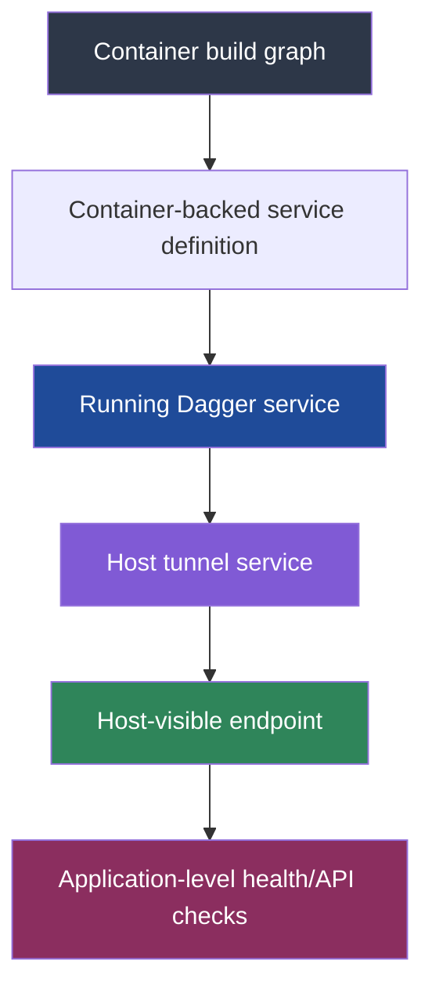

# Playbook: Debugging Dagger Service and Host Tunnel Lifecycle

This note captures a reusable debugging pattern for Dagger-based services that appear to be “running but unreachable”, “stuck in start”, or “healthy inside the container but broken from the host”. The triggering case was the [[PROJ - Transcription Go - Dagger Nemotron ASR Pipeline|Transcription Go]] project, but the underlying lessons are broader than speech recognition or FastAPI.

The core lesson is simple and surprisingly easy to miss: in Dagger, a working container build, a valid service definition, a started service, a started host tunnel, and a reachable host endpoint are *different states*. A system can succeed at one layer and fail at the next while presenting symptoms that make it look like the earlier layer is broken.

> [!summary]
> When a Dagger-hosted service seems blocked, check these in order:
> 1. is the runtime command actually attached to the **service**, not just a `WithExec` build step?
> 2. are you starting the **correct object** — the container-backed service, the tunnel, or neither?
> 3. are you resolving the **host-facing endpoint** correctly, rather than forcing a colliding native port?
> 4. are you accidentally talking to a different local service on the same host port?

## Why this note exists

Dagger’s API encourages a very compositional style, which is a strength, but it also means different layers of runtime behavior can look deceptively similar in code:

- build a container
- convert it to a service
- create a host tunnel
- retrieve an endpoint
- query the endpoint

The problem is that if even one of those steps is subtly wrong, the failure mode often looks like something else.

A few examples:

- a service command attached in the wrong place looks like a startup hang
- an unstarted tunnel looks like a dead service
- a fixed host port collision looks like a broken health endpoint
- a cached build layer can make you think the correct runtime is being used when it is not

This note exists to preserve the mental model and the debugging sequence that turned a frustrating, long-running “Dagger seems blocked” problem into a systematic diagnosis.

## When to use this pattern

Use this playbook when you have a Dagger pipeline that does some version of:

- `Container(...).AsService(...)`
- `Host.Tunnel(service)`
- `Service.Start()` / `Service.Up()` / `Service.Endpoint()`
- a long-running runtime process such as:
  - uvicorn
  - nginx
  - postgres
  - redis
  - a model server
  - a custom HTTP API

Especially apply it when:

- the service logs suggest the application *did* start
- but the host cannot reach it
- or `Service.start` / `Endpoint` behaves in a confusing way
- or the observed host endpoint returns a valid HTTP response that does not match your app

## Core mental model

The easiest way to avoid confusion is to separate the lifecycle into five layers.



Each layer answers a different question:

- **Container build graph**: can the filesystem, packages, and build steps be constructed?
- **Service definition**: does Dagger know how to run this thing as a service?
- **Running Dagger service**: is the service process alive inside the Dagger runtime?
- **Host tunnel service**: is Dagger exposing that service into the host network?
- **Host-visible endpoint**: what `host:port` should the caller use?
- **Application-level health/API checks**: does the actual app behind that endpoint behave as expected?

A failure at layer 5 can look like a failure at layer 2 if you do not explicitly inspect the intermediate states.

## The most important rule: `WithExec(...)` is not always your runtime command

A subtle but critical point in Dagger service construction is this:

> A `WithExec(...)` call in the container chain is part of the *container graph*. It is not necessarily the same thing as the runtime command that `AsService(...)` will use.

That matters because many developers naturally write something like this:

```go
ctr := client.Container().
    From("python:3.11-slim-bookworm").
    WithExec([]string{"pip", "install", "-r", "requirements.txt"}).
    WithExposedPort(8000).
    WithExec([]string{"uvicorn", "server:app", "--host", "0.0.0.0", "--port", "8000"})

service := ctr.AsService()
```

This *looks* reasonable. The last `WithExec` feels like “the command this container should run”. But for service runtime semantics, the safer and more explicit pattern is:

```go
ctr := client.Container().
    From("python:3.11-slim-bookworm").
    WithExec([]string{"pip", "install", "-r", "requirements.txt"}).
    WithExposedPort(8000)

service := ctr.AsService(dagger.ContainerAsServiceOpts{Args: []string{
    "uvicorn", "server:app",
    "--host", "0.0.0.0",
    "--port", "8000",
}})
```

This makes the runtime command an explicit property of the service conversion step.

### Why this matters in practice

If the runtime command is attached incorrectly, the failure mode can be misleading:

- all build layers may appear cached and valid
- the service graph may exist
- Dagger may still show a service node in traces
- but the process you think is running as the service is not actually the process Dagger is managing as the service runtime

That leads to “it hangs in start” or “service not running” confusion.

## The second important rule: the tunnel may be the object you need to start

If your goal is host reachability, the container-backed service is not always the last lifecycle object that matters. Once you create a host tunnel, you now have another service-shaped object in the system.

Pattern:

```go
service := ctr.AsService(...)
tunnel := client.Host().Tunnel(service)
```

From the host caller’s perspective, **the tunnel is the thing that exposes the app locally**.

A good working pattern is:

```go
service := ctr.AsService(...)
tunnel := client.Host().Tunnel(service)
tunnel, err := tunnel.Start(ctx)
endpoint, err := tunnel.Endpoint(ctx)
```

If you skip starting the tunnel, you may get errors like:

```text
service ... is not running
```

and interpret them as “the app inside the container is broken”, when the real issue is that the host-facing path was never actually made live.

## The third important rule: do not force a host port unless you truly need to

When debugging, it is tempting to force `localhost:8000` or another familiar port. This can create a nasty class of false signals.

A host-port collision can make the system look like this:

- Dagger service is fine
- tunnel exists
- the app inside the container is fine
- `curl http://127.0.0.1:8000/...` returns a real HTTP response
- but the response is from a *different* process already bound to that host port

This is worse than a hard failure because it looks valid.

A representative symptom is:

```text
HTTP/1.1 404 Not Found
{"detail":"Not Found"}
```

That can make you think your route is wrong, when the truth is that you are talking to some unrelated local Python or Node process.

Prefer:

```go
endpoint, err := tunnel.Endpoint(ctx)
```

and let Dagger assign a random safe frontend port.

Then inspect the returned endpoint directly.

## Recommended implementation sequence

When building a Dagger-hosted service from scratch, use this order.

### 1. Build the container graph first

Keep the container graph focused on filesystem/runtime preparation.

```go
ctr := client.Container().
    From("python:3.11-slim-bookworm").
    WithExec([]string{"sh", "-c", "apt-get update && apt-get install -y --no-install-recommends git ffmpeg && rm -rf /var/lib/apt/lists/*"}).
    WithDirectory("/app", serverDir).
    WithWorkdir("/app").
    WithExec([]string{"pip", "install", "-r", "requirements.txt"}).
    WithExposedPort(8000)
```

This phase is about making the runtime environment exist, not about the final long-lived command.

### 2. Convert to a service with explicit runtime args

```go
service := ctr.AsService(dagger.ContainerAsServiceOpts{Args: []string{
    "uvicorn", "server:app",
    "--host", "0.0.0.0",
    "--port", "8000",
}})
```

This answers: “what process should Dagger actually keep alive as the service?”

### 3. Create and start the host tunnel

```go
tunnel := client.Host().Tunnel(service)
tunnel, err := tunnel.Start(ctx)
```

This answers: “how does the host actually reach it?”

### 4. Resolve the default tunnel endpoint

```go
endpoint, err := tunnel.Endpoint(ctx)
```

This answers: “what `host:port` is valid *on this machine right now*?”

### 5. Run application-level health checks

```go
resp, err := http.Get("http://" + endpoint + "/health")
```

This answers: “is the app behind that endpoint the app I intended?”

## Debugging checklist

When the system appears blocked, check these in order.

### A. Is the runtime command attached to the service definition?

Inspect the code and the Dagger trace.

You want the trace to look conceptually like:

```text
Container.asService(args: ["uvicorn", ...]): Service!
```

If the runtime command only appears as a `Container.withExec(...)` step in the container graph, you may be debugging the wrong lifecycle behavior.

### B. Is the tunnel being started?

If the service exists but `Endpoint` says it is not running, ask whether you are actually starting the tunnel object.

### C. Are you resolving the correct endpoint?

Prefer the tunnel’s default endpoint rather than forcing `port: 8000` unless you understand exactly how frontend/backend mapping is being applied.

### D. Is the endpoint actually your app?

From outside the Dagger process, probe the endpoint directly:

```bash
curl -i http://127.0.0.1:PORT/health
curl -i http://127.0.0.1:PORT/
ss -ltnp | grep ':PORT'
pgrep -af 'python|node|uvicorn|whatever'
```

If the port is occupied by a local process you forgot about, that is often the entire explanation.

### E. Are the logs coming from the layer you think they are?

There are at least three distinct logs in a setup like this:

- your application logs
- the Dagger SDK / trace output
- Docker/Dagger engine logs

Read them as different evidence sources rather than one blended story.

## Common failure modes

## Failure mode 1: “`Service.start` hangs forever”

### Symptom

Dagger trace shows a start node that never seems to complete.

### Likely causes

- runtime command attached incorrectly
- application startup is genuinely slow
- health/readiness is being checked on the wrong object or wrong port

### What to do

- confirm where the long-running command is specified
- inspect the app logs independently of the SDK trace
- move the runtime command into `AsService(...Args...)` if appropriate

## Failure mode 2: “service is not running” when asking for endpoint

### Symptom

Endpoint resolution fails even though the app logs suggest the service came up.

### Likely causes

- tunnel service not started
- wrong service object queried for endpoint

### What to do

- explicitly start the tunnel object
- resolve endpoint from the tunnel, not from a stale assumption about host mapping

## Failure mode 3: valid HTTP response, wrong application

### Symptom

You get a real HTTP response — maybe even a 200 or a clean JSON error — but not from your app.

### Likely causes

- forced host port collides with an existing local service

### What to do

- inspect `ss -ltnp` / `netstat`
- use a random tunnel endpoint instead of forcing a host port
- curl the random endpoint returned by Dagger

## Failure mode 4: build looks cached, so runtime must be right

### Symptom

Because all layers are `CACHED`, you assume the runtime configuration is correct.

### Why this is dangerous

Cache hits only prove that some graph nodes are reused. They do not prove that the long-running runtime command is attached to the service in the way you think.

## Anti-patterns

### Anti-pattern 1: treating the last `WithExec(...)` as “the service command”

This is the most important one. In a Dagger service workflow, be explicit.

### Anti-pattern 2: debugging long-running startup in a foreground agent/session only

If the startup is expensive, use `tmux`, `screen`, or another durable shell context. Otherwise your inspection attempts can repeatedly destroy the process you are trying to inspect.

A good pattern is:

```bash
tmux new-session -d -s my-run 'your-long-command 2>&1 | tee logs/run.log'
tmux capture-pane -pt my-run:0 | tail -100
tail -f logs/run.log
```

### Anti-pattern 3: assuming `localhost:8000` is “probably free” on a development machine

It often is not.

### Anti-pattern 4: reading only one log source

Application logs, SDK trace logs, and engine logs answer different questions. Treat them as separate instruments.

## Working rules

> [!important]
> When Dagger service startup seems weird, first separate **runtime command placement**, **service lifecycle**, **tunnel lifecycle**, and **host endpoint selection**. Do not treat them as one problem.

> [!important]
> Prefer random host tunnel endpoints during debugging. Fixed host ports are a convenience feature, not a debugging aid.

> [!important]
> Use `tmux` or an equivalent background session for long-lived Dagger runs so you can inspect without restarting.

## Example: the fixed pattern in practice

A practical fixed sequence from the source project looked like this:

```go
ctr := client.Container().
    From("python:3.11-slim-bookworm").
    WithExec([]string{"sh", "-c", "apt-get update && apt-get install -y --no-install-recommends git ffmpeg && rm -rf /var/lib/apt/lists/*"}).
    WithMountedCache("/root/.cache/huggingface", hfCache).
    WithMountedCache("/root/.cache/pip", pipCache).
    WithDirectory("/app", serverDir).
    WithWorkdir("/app").
    WithExec([]string{"pip", "install", "-r", "requirements.txt"}).
    WithExposedPort(opts.Port)

service := ctr.AsService(dagger.ContainerAsServiceOpts{Args: []string{
    "uvicorn", "server:app",
    "--host", "0.0.0.0",
    "--port", fmt.Sprintf("%d", opts.Port),
}})

tunnel := client.Host().Tunnel(service)
tunnel, err = tunnel.Start(ctx)
endpoint, err := tunnel.Endpoint(ctx)
```

Successful host-side evidence looked like:

```text
Tunnel established at 127.0.0.1:32935, waiting for health check...
Health check passed (attempt 1)
ASR server ready at 127.0.0.1:32935
```

That one endpoint line matters a lot. The random port is often your proof that you are finally talking to the correct host-facing path rather than colliding with a local process.

## Commands I actually recommend during debugging

### Inspect the Dagger-facing logs

```bash
docker logs dagger-engine-v0.20.5 2>&1 | tail -200
```

### Inspect the long-running app session

```bash
tmux capture-pane -pt SESSION:0 | tail -120
```

### Verify what is really bound on the host

```bash
ss -ltnp | grep ':8000'
pgrep -af 'python|node|uvicorn'
```

### Probe the actual endpoint you think you have

```bash
curl -i http://127.0.0.1:RANDOM_PORT/health
curl -i http://127.0.0.1:RANDOM_PORT/
```

### If you still need a fixed host port later

Only force a host port after the random-endpoint path is proven correct.

## What this pattern generalizes to

This is not just about FastAPI or ASR servers.

The same pattern applies to:

- local Postgres/Redis services started via Dagger
- small HTTP APIs used in test harnesses
- headless browser services
- reverse proxies
- model-serving containers
- any service where the host needs to talk to a container-backed process through Dagger

The technology-specific pieces change. The failure-class structure does not.

## Related notes

- [[PROJ - Transcription Go - Dagger Nemotron ASR Pipeline|Transcription Go]]

## Final takeaway

The most reusable lesson here is not a code snippet. It is a habit of mind:

When a Dagger service looks blocked, do not ask only “why won’t my app start?” Ask instead:

1. what process is Dagger actually managing as the service runtime?
2. what object am I actually starting?
3. what object am I actually resolving an endpoint from?
4. what process is actually bound to the host port I am curling?

Once you ask those four questions separately, most “mysterious Dagger service hangs” become ordinary lifecycle or addressing bugs — which is much better news than it first appears.
