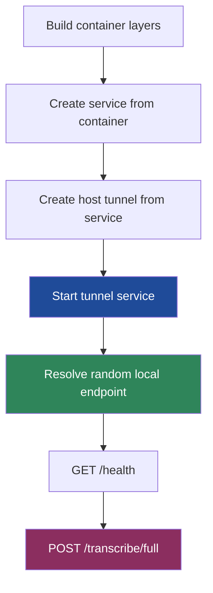

# Transcription Go

This project is a self-contained transcription pipeline that uses a Go CLI for orchestration, conversion, formatting, and persistence, and a Dagger-managed Python service for NVIDIA Nemotron speech recognition. The design goal is deliberately narrow and practical: take the output of a local screencast workflow, transcribe it reliably without requiring host `ffmpeg`, and produce outputs that are immediately usable as subtitles, readable text, and a SQLite database for later analysis.

The interesting part is not only that the pipeline works, but *how* it was made to work. The final system ended up being a study in boundary placement: audio conversion in pure Go, ASR inference in a cached Dagger service, formatting and persistence back in Go, and a surprisingly subtle host-tunnel lifecycle fix that turned a “Dagger seems hung” debugging session into a clean end-to-end transcription run.

> [!summary]
> This project currently has four important identities:
> 1. a pure-Go local transcription CLI that avoids host `ffmpeg`
> 2. a Dagger-orchestrated long-running ASR service with cached model and dependency layers
> 3. a compatibility-minded output pipeline that writes SRT, VTT, TXT, and SQLite from Go
> 4. a worked example of how Dagger `AsService`, host tunnels, and runtime command placement can fail in non-obvious ways

## Why this project exists

The immediate need came from local screencast recordings that already exist as large WAV files. There was already a Python-based transcript pipeline in a neighboring project, but this repository exists to push the architecture in a more controlled direction:

- keep the *host* dependency surface small
- push runtime container orchestration into Dagger
- keep the ASR model warm in a long-running process rather than paying process/model startup per chunk
- move final output shaping into Go instead of letting Python define the final transcript artifact format
- preserve compatibility with the earlier SQLite-oriented transcript analysis workflow

This is also a “project simplification” effort. The project intentionally keeps the Python side narrow: it loads the ASR model, accepts a WAV upload, runs inference, and returns word timings. Everything else that is product-shaping — filtering filler words, segmenting subtitles, writing SQLite, deciding output formats, and driving the CLI — happens in Go.

## Current project status

The pipeline is working end-to-end.

What is implemented today:

- a Go CLI in `cmd/transcribe/main.go`
- pure-Go WAV conversion in `internal/convert/convert.go`
- a Dagger service/tunnel lifecycle manager in `internal/server/dagger.go`
- an HTTP ASR client in `internal/asr/client.go`
- Go output writers in `internal/output/` for:
  - SRT
  - VTT
  - TXT
  - SQLite
- a Python FastAPI ASR server in `server/server.py`
- pinned Python dependencies in `server/requirements.txt`
- a successful end-to-end rabbit-hole transcription run

What has already been validated:

- pure-Go WAV conversion benchmark: roughly `2.9s` on the test recording
- containerized model startup with cached dependencies and cached HF model
- successful health-check and host tunnel establishment via Dagger
- successful transcription of a ~27.7 minute WAV file
- final SQLite output with `4226` words versus `4248` in the reference transcript database

What is still open:

- understanding the `-22` word delta versus the reference pipeline
- deciding whether server-side progress reporting should become richer than the current client heartbeat
- deciding whether the Python side should expose chunk metadata explicitly for easier validation

## Project shape

The repository has a clean split between orchestration, inference, and formatting.

```text
cmd/transcribe/             Go CLI entry point
internal/convert/           pure-Go WAV conversion
internal/server/            Dagger ASR service lifecycle + host tunnel
internal/asr/               HTTP client for /transcribe/full
internal/output/            SRT/VTT/TXT/SQLite generation
server/                     FastAPI + Nemotron ASR runtime
```

At a high level, the user-facing flow is:

1. read input WAV
2. convert to 16kHz mono PCM WAV in Go
3. start the ASR runtime in Dagger
4. establish a host tunnel to the running service
5. upload the converted WAV to the server
6. receive word-level timestamps as JSON
7. write all final artifacts in Go

## Architecture

```mermaid
flowchart LR
    A[Input WAV<br/>large stereo screencast recording] --> B[Go converter<br/>internal/convert]
    B --> C[16k mono WAV<br/>out/audio_16k_mono.wav]
    C --> D[Go CLI<br/>cmd/transcribe]
    D --> E[Dagger container service<br/>python + ffmpeg + nemo + fastapi]
    E --> F[FastAPI endpoint<br/>POST /transcribe/full]
    F --> G[Nemotron ASR model<br/>CPU eval mode]
    G --> H[JSON words[]<br/>word start end]
    H --> I[Go output layer<br/>internal/output]
    I --> J[SRT]
    I --> K[VTT]
    I --> L[TXT]
    I --> M[SQLite]

    style A fill:#2d3748,color:#fff
    style E fill:#1f4b99,color:#fff
    style G fill:#8b2e5f,color:#fff
    style M fill:#2f855a,color:#fff
```

The important architectural choice is that the Python service is treated as a reusable inference engine, not as the top-level product. The Go binary is the actual product boundary.

## Narrative deep dive: what got built and why it looks this way

### Phase 1: narrow the problem to the actual input format

One of the key simplifying decisions was to stop solving “arbitrary media conversion” and instead solve the actual problem at hand: large local WAV files produced by the screencast workflow. The user explicitly wanted no host `ffmpeg` dependency, which ruled out the easiest path and forced a more honest design question:

> if the input is already WAV PCM, can the conversion stage stay entirely inside Go?

The answer turned out to be yes.

That changed the project in a useful way. Instead of building a universal audio frontend, the pipeline became a high-confidence path for the audio format that actually matters here. That is often the better engineering move: build the smallest thing that is correct for the real input set.

### Phase 2: keep the model warm

The second major design decision was to stop thinking of the ASR call as a one-shot container invocation and instead treat it as a long-running service. This matters because model startup is expensive, dependency installation is expensive when cold, and inference becomes much more tolerable when those costs are amortized.

That led to the Dagger service design:

- install Python dependencies in the Dagger container
- mount a pip cache
- mount a HuggingFace cache
- load the model once in FastAPI lifespan startup
- keep uvicorn alive as a reusable service
- expose it to the host with a Dagger tunnel

From the outside this looks like a small CLI. Internally it is closer to a two-process system: a Go orchestrator and a Python model server.

### Phase 3: move output shaping into Go

The output layer was intentionally pulled out of Python. This is one of the strongest decisions in the project because it gives the repository a clearer center of gravity.

The Python side returns a simple contract:

```json
{
  "words": [
    {"word": "hello", "start": 12.34, "end": 12.61}
  ],
  "total_duration": 1664.8,
  "chunk_count": 28,
  "word_count": 4226
}
```

Once that contract exists, everything user-visible can be changed, tested, and evolved from Go:

- subtitle segmentation policy
- filler word removal
- text formatting
- SQLite schema
- compatibility with downstream transcript analysis tools

This makes the Python service more replaceable over time.

## Implementation details

## Pure-Go audio conversion

The Go converter lives in `internal/convert/convert.go`. It uses:

- `github.com/go-audio/wav`
- `github.com/go-audio/audio`
- `github.com/oov/audio/resampler`

The converter is intentionally streaming-oriented. It processes roughly 100ms chunks rather than reading the full input into memory.

That detail matters because one naive design path in audio tooling is to decode the full file into a giant in-memory PCM buffer. On long recordings this becomes both slower and much more memory-hungry than expected.

The implemented conversion loop is essentially:

```go
open input wav
validate format
seek to PCM data
for each ~100ms chunk:
    read PCM frames
    downmix N channels -> mono by averaging
    resample input sample rate -> 16kHz
    clamp to PCM16 range
    write chunk to output wav encoder
close encoder
```

The converter also has a useful fast path: if the file is already `16kHz`, mono, and in the desired format, it just copies the file.

### Why the streaming shape matters

The benchmark result that shaped confidence in this approach was simple but important:

- pure Go streaming conversion: ~`2.9s`
- equivalent `ffmpeg` run: ~`3.5s`

That result did not just remove a dependency. It justified the design direction.

## Dagger service lifecycle: the sharp edge that took the most debugging

The hardest part of the project was not the ASR model or the audio conversion. It was the Dagger service lifecycle.

The final version in `internal/server/dagger.go` looks conceptually like this:

```go
ctr := client.Container().
    From("python:3.11-slim-bookworm").
    WithExec([]string{"sh", "-c", "apt-get update && apt-get install -y --no-install-recommends git ffmpeg && rm -rf /var/lib/apt/lists/*"}).
    WithMountedCache("/root/.cache/huggingface", hfCache).
    WithMountedCache("/root/.cache/pip", pipCache).
    WithDirectory("/app", serverDir).
    WithWorkdir("/app").
    WithExec([]string{"pip", "install", "-r", "requirements.txt"}).
    WithExposedPort(opts.Port)

service := ctr.AsService(dagger.ContainerAsServiceOpts{Args: []string{
    "uvicorn", "server:app",
    "--host", "0.0.0.0",
    "--port", fmt.Sprintf("%d", opts.Port),
}})

tunnel := client.Host().Tunnel(service)
tunnel, err = tunnel.Start(ctx)
endpoint, err := tunnel.Endpoint(ctx)
```

The critical subtlety is this:

> the long-running uvicorn command belongs in `AsService(...Args...)`, not in a prior `WithExec(...)` build step.

That was the debugging breakthrough.

### What went wrong before the fix

The earlier versions failed in a particularly confusing sequence:

1. first the pipeline looked stuck in `Service.Start()`
2. then the endpoint call failed with “service is not running”
3. then health checks returned `404`

Those looked like three different bugs. In practice they were three layers of the same lifecycle/addressing problem.

The actual root causes were:

- `WithExec(uvicorn ...)` defined a build step, not the runtime service command
- the host tunnel was not the object being started
- the code briefly forced host port `8000`, which collided with an unrelated local Python service already bound to `127.0.0.1:8000`

That last point was especially misleading. The `404 Not Found` response came from a *different app*, not from the ASR service.

### The final host-tunnel mental model



The key lesson is that in this setup the object you need for host access is the *tunnel service*, not only the underlying container-backed service.

## Python ASR server

The Python server in `server/server.py` is intentionally compact. It does three important things:

1. loads the Nemotron model once at startup
2. exposes `/health`
3. accepts a WAV upload at `/transcribe/full`, chunks it internally, and returns timed words

The FastAPI lifespan hook is the important structural piece:

```python
@asynccontextmanager
async def lifespan(app: FastAPI):
    global asr_model, time_stride
    import nemo.collections.asr as nemo_asr

    asr_model = nemo_asr.models.ASRModel.from_pretrained(
        "nvidia/nemotron-speech-streaming-en-0.6b"
    )
    asr_model = asr_model.cpu().eval()
    ...
    yield
```

This means the expensive work happens once, not for every request.

### Why ffmpeg is still inside the container

There is an apparent contradiction in the project story:

- the host-side pipeline is “pure Go, no ffmpeg dependency”
- but the server container still installs and uses `ffmpeg`

That is intentional and acceptable.

The no-`ffmpeg` requirement was about the *host environment*. The server container is free to use `ffmpeg` internally because it is isolated, reproducible, and not part of the user’s machine-level dependency burden.

The Python code uses it to extract chunk windows cleanly before running inference. That keeps the server implementation straightforward while preserving the host-side purity goal.

## HTTP contract and client behavior

The Go client in `internal/asr/client.go` is simple by design:

- open the converted WAV
- build a multipart request
- send `POST /transcribe/full`
- decode JSON response

It currently uses an `http.Client` with no timeout:

```go
client: &http.Client{Timeout: 0}
```

That is the right tradeoff for a long-running inference call where request duration is dominated by ASR work rather than a quick API round trip.

The client also intentionally hides all subtitle or formatting policy. Its job is just transport and decoding.

## Output formatting in Go

The output writers in `internal/output/` are where the project turns from “model wrapper” into “transcript product.”

### Word model

The internal word model is small and practical:

- `word`
- `start`
- `end`

That is enough to drive all current output formats.

### Subtitle building

The formatter builds subtitle segments from words using Go logic rather than inheriting any subtitle segmentation behavior from Python. This is important because segment boundaries are an editorial/product choice, not an inference-model choice.

The current segmentation is based on:

- time window targets
- maximum character-ish limits / word grouping heuristics
- optional filler word filtering before segmentation

### SQLite output

The SQLite writer is one of the most useful parts of the project because it makes transcripts queryable and compatible with downstream workflows.

The project uses `modernc.org/sqlite`, which keeps SQLite access pure Go and avoids CGO.

This gives the CLI an especially nice property:

> the final binary can produce structured searchable transcript artifacts without depending on native SQLite build tooling.

## End-to-end validation result

The most important validation run used the rabbit-hole recording:

- input: `/home/manuel/code/wesen/2026-04-09--screencast-studio/recordings/rabbit-hole-2026-04-10--2/audio-mix.wav`
- converted duration: `1664.8s` (~27.7 minutes)
- chunk size: `60s`
- final word count: `4226`
- reference word count: `4248`
- delta: `-22`

Final outputs written:

- `out/transcript.srt`
- `out/transcript.db`

The transcription wall-clock time on this machine was roughly five minutes once the model and dependencies were already cached.

## What the successful run proved

The successful run proved more than “the code works.” It validated several design bets at once:

- the host can stay free of `ffmpeg`
- pure-Go conversion is not a slow compromise
- Dagger caches are enough to make repeat runs practical
- the model can live behind a long-running service boundary
- Go is a good place to own transcript formatting and persistence
- the Dagger service/tunnel handoff can be made reliable once the runtime command and endpoint logic are correct

## Observability and the tmux-backed debugging method

One of the most useful process improvements was moving the long run into `tmux`.

That enabled a practical debugging loop:

```bash
tmux new-session -d -s transcribe-e2e '... ./transcribe ... | tee logs/...'
tmux capture-pane -pt transcribe-e2e:0 | tail -100
tail -f logs/transcribe-e2e-*.log
docker logs dagger-engine-v0.20.5
```

This matters because model startup and long-running inference interact badly with an agent/session model where every interruption can kill the process being inspected.

The repository now also has better Go-side progress logging for future runs:

- estimated audio duration
- estimated chunk count
- periodic heartbeat while waiting for the ASR request to complete
- richer completion log

That is not glamorous, but it materially improves the ergonomics of the tool.

## Current user-facing commands

The core command shape is:

```bash
go run ./cmd/transcribe \
  --input /path/to/audio.wav \
  --output-dir ./out \
  --format srt,db \
  --no-fillers \
  --verbose
```

Useful variants:

```bash
# build first
 go build -o transcribe ./cmd/transcribe

# run against the rabbit-hole recording
./transcribe \
  --input /home/manuel/code/wesen/2026-04-09--screencast-studio/recordings/rabbit-hole-2026-04-10--2/audio-mix.wav \
  --output-dir ./out \
  --format srt,db \
  --no-fillers \
  --verbose
```

## Important project docs

Repo-local ticket docs worth reading alongside the code:

- `/home/manuel/code/wesen/2026-04-13--transcription-go/ttmp/2026/04/13/TRANSCRIPTION-GO--go-dagger-transcription-pipeline/design-doc/01-go-dagger-transcription-pipeline-design-and-implementation-plan.md`
- `/home/manuel/code/wesen/2026-04-13--transcription-go/ttmp/2026/04/13/TRANSCRIPTION-GO--go-dagger-transcription-pipeline/reference/01-diary.md`
- `/home/manuel/code/wesen/2026-04-13--transcription-go/ttmp/2026/04/13/TRANSCRIPTION-GO--go-dagger-transcription-pipeline/tasks.md`
- `/home/manuel/code/wesen/2026-04-13--transcription-go/ttmp/2026/04/13/TRANSCRIPTION-GO--go-dagger-transcription-pipeline/changelog.md`

Key implementation files:

- `/home/manuel/code/wesen/2026-04-13--transcription-go/cmd/transcribe/main.go`
- `/home/manuel/code/wesen/2026-04-13--transcription-go/internal/convert/convert.go`
- `/home/manuel/code/wesen/2026-04-13--transcription-go/internal/server/dagger.go`
- `/home/manuel/code/wesen/2026-04-13--transcription-go/internal/asr/client.go`
- `/home/manuel/code/wesen/2026-04-13--transcription-go/internal/output/format.go`
- `/home/manuel/code/wesen/2026-04-13--transcription-go/internal/output/sqlite.go`
- `/home/manuel/code/wesen/2026-04-13--transcription-go/server/server.py`

## Open questions

- Why is the final word count `22` words below the reference pipeline?
- Is the overlap policy in Python chunking the right one, or does it create subtle duplication/drop behavior at boundaries?
- Should the server emit structured chunk progress so the Go client can show true chunk completion rather than a generic heartbeat?
- Should the upload path become streaming instead of building the full multipart body in memory first?
- Is there value in prebuilding the Python image as a separate artifact, or is Dagger cache performance already good enough?

## Near-term next steps

- compare the `4226`-word output against the `4248`-word reference more carefully
- inspect chunk boundaries and duplicate/drop behavior
- consider richer per-chunk progress reporting
- decide whether the current CPU-only Nemotron setup is “fast enough” for routine use or whether GPU-backed execution becomes worth pursuing later
- keep the Go ownership of formatting/output even if the ASR backend changes in the future

## Project working rule

> [!important]
> Keep the product boundary in Go.
> Treat the Python container as a replaceable inference engine, not the place where transcript artifact policy, formatting, or persistence logic should live.

## Personal technical takeaway

This project is a good reminder that the most time-consuming bugs in orchestration-heavy tools are often not “big algorithm” problems. The ASR model loaded. The WAV conversion worked. The JSON contract was fine. The thing that actually blocked the project was the gap between three almost-correct statements:

- “the service is running”
- “the tunnel exists”
- “the endpoint I am curling is the right one”

Those are not the same statement.

That distinction is the kind of systems detail that gets lost quickly if it is not written down. This project note is partly here to preserve that lesson for the next time a Dagger service appears to be hung when the real problem is runtime-command placement, tunnel lifecycle, or host-port collision.
