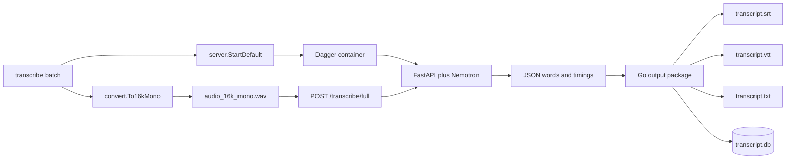

# Current System and Video Corpus Gap Analysis

## Executive conclusion

The existing repository is a strong base for the video pipeline, but it is currently a **single-audio-file product**. It already solves the expensive and difficult part: a Go CLI starts a Dagger-hosted Python service, the service loads NVIDIA Nemotron once, long audio is divided into bounded chunks, word-level timestamps return over HTTP, and Go writes subtitle, text, and SQLite artifacts. The Southwell run has already demonstrated that this path works end to end.

The adaptation should not replace that implementation. It should add a corpus orchestration layer around it. The key change is moving the lifecycle boundary outward:

```text
current:  one CLI invocation -> one service -> one audio file -> one transcript.db
proposed: one corpus invocation -> one service -> many videos -> one canonical corpus.db
```

Per-video files remain useful as exports and recovery artifacts, but corpus identity, source provenance, job state, words, chunks, and searchable text should live in one database.

## Current architecture



### CLI and orchestration

`cmd/transcribe/root.go` exposes the root command, `batch`, and `live`. Both the root invocation and `batch` call `runBatch` in `cmd/transcribe/batch.go`.

`runBatch` performs these operations in order:

1. Validate `--input`.
2. Resolve the Python server directory.
3. Create the output directory.
4. Convert the WAV into `audio_16k_mono.wav`.
5. Start the Dagger ASR service.
6. Upload the entire normalized WAV to `/transcribe/full`.
7. Convert ASR words into `output.Word`.
8. Write requested per-file formats.
9. Stop the service when the function returns.

This is correct for one file but inefficient for a playlist because step 5 loads the model for every invocation.

### Audio conversion

`internal/convert/convert.go` is a streaming pure-Go WAV converter. It uses `go-audio/wav` and `oov/audio/resampler`, downmixes channels, resamples to 16 kHz, and writes PCM16 in approximately 100 ms buffers. Memory use is bounded by chunk size rather than input duration.

Important constraints:

- The converter accepts WAV, not arbitrary MP4/MKV/M4A input.
- Already-16-kHz mono input uses `copyFile`, which currently reads the complete file into memory with `os.ReadFile`; the normal conversion path streams.
- Video demux belongs upstream or in a new media adapter. The Southwell pipeline already produces normalized WAV files, so the first corpus implementation should consume those rather than adding video decoding to the core ASR package.

### Dagger and model lifecycle

`internal/server/dagger.go` builds a Python 3.11 container, installs Git and FFmpeg, mounts HuggingFace and pip cache volumes, installs `server/requirements.txt`, mounts the server source, and starts Uvicorn through `Container.AsService`.

The correct lifecycle is already implemented:

```text
container definition
  -> AsService(runtime Uvicorn command)
  -> Host().Tunnel(service)
  -> tunnel.Start(ctx)
  -> tunnel.Endpoint(ctx)
  -> GET /health until model_loaded
```

The model stays warm only for the lifetime of one `ASRServer`. The proposed corpus command can reuse `StartDefault`, but must start it once outside the per-video loop.

### ASR transport

`internal/asr/client.go` defines:

- `GET /health`
- `POST /transcribe/full`
- `POST /transcribe/chunk`

`TranscribeFull` returns `words`, `total_duration`, `chunk_count`, and `word_count`. The HTTP client has no timeout, which is appropriate for long inference requests.

One scaling issue is important: `uploadAudio` builds the complete multipart request in a `bytes.Buffer`. This creates at least one full-file in-memory copy before the request is sent. It worked for the 171.5-second Southwell smoke file, but long lectures may produce hundreds of megabytes of WAV data. The corpus implementation should replace this with streaming multipart via `io.Pipe`, or use a service-visible file mount in a later optimization.

### Python inference service

`server/server.py` loads `nvidia/nemotron-speech-streaming-en-0.6b` in FastAPI lifespan startup and sets:

```python
decoding_cfg.preserve_alignments = True
decoding_cfg.compute_timestamps = True
decoding_cfg.segment_separators = []
decoding_cfg.word_separator = " "
time_stride = 8 * asr_model.cfg.preprocessor.window_stride
```

`POST /transcribe/full` writes the uploaded WAV to a temporary file, obtains duration with SoundFile, and processes approximately 60-second chunks with a two-second extension. Returned word timestamps are offset by each chunk's start time.

Observed gaps:

- Full-file output does not include per-word confidence or chunk index.
- Overlap words are appended without explicit boundary deduplication.
- The complete upload is read into Python memory with `await file.read()` before being written.
- Processing progress exists only in server logs; the client receives no per-chunk events.
- The response is returned only when the full video is complete, so an interrupted request persists no partial progress.

These are not blockers for a first corpus command, but they define the reliability ceiling.

### Output formats

`internal/output/format.go` owns subtitle/text segmentation. `BuildSegments` splits on punctuation, maximum duration, or maximum characters.

Two correctness issues should be fixed before corpus-scale publication:

1. If the final buffer does not end on a split condition, its `Segment.End` is written as `0` instead of the last word's end time.
2. `WriteSRT`, `WriteVTT`, and `WriteTXT` return errors, but `writeBatchOutputs` currently ignores those writer errors.

`internal/output/sqlite.go` creates `words`, `chunks`, and `chunk_words`. It matches the earlier Python pipeline structurally, but it is scoped to one file and has no `video_id`. It also computes `word_count` using `splitWords`, whose helper `split` currently returns an empty slice. Chunk `word_count` is therefore incorrect even though `chunk_words` links are populated.

### Existing validation

The repository has tests for:

- audio conversion;
- ASR HTTP client behavior;
- filler filtering;
- subtitle formatting;
- per-file SQLite words/chunks;
- live transcript accumulation and sinks;
- WebSocket client/server state.

The current tests validate isolated components but not:

- multiple videos in one process;
- warm-service reuse;
- corpus transaction boundaries;
- resume after failure;
- source hash changes;
- simultaneous corpus readers;
- FTS search and timestamp deep links.

## Concrete source corpus

The immediate target is:

```text
/home/manuel/Movies/richard-southwell-category-theory-for-beginners/
```

Observed artifacts include:

- `playlist-flat.json`: 37 playlist entries;
- 36 accessible downloaded MP4 files;
- `media-manifest.json`: 36 hashed/probed media records;
- `audio/`: 36 normalized WAV files;
- `corpus.db`: a provisional YouTube-caption FTS index;
- one validated Nemotron output under `transcripts/019-my-new-category-theory-book/`.

Playlist item 35 (`y8WC6ngApmU`) is members-only. The corpus model must represent unavailable entries rather than silently reducing the expected playlist count from 37 to 36.

## Capability gap matrix

| Concern | Current system | Required corpus behavior |
|---|---|---|
| Input | One WAV path | Versioned manifest plus many WAV/media records |
| Service lifetime | One file | One warm service per corpus run |
| Identity | Output directory | Stable corpus ID and YouTube/source video ID |
| Persistence | One `transcript.db` | One canonical corpus database plus exports |
| Resume | Re-run whole file manually | Per-video state and idempotent skip/retry |
| Provenance | Implicit input path | Source hash, audio hash, model/config identity |
| Failures | CLI returns error | Failure row with attempt and retry state |
| Progress | Logs/heartbeat | Corpus totals and per-video state transitions |
| Search | Per-file SQL | Corpus-wide word, chunk, and FTS search |
| Exports | Per-file SRT/VTT/TXT | Same exports, generated from canonical rows |
| Missing media | Outside model | Explicit unavailable/skipped video status |
| Model reuse | Not across invocations | Reuse within corpus command |
| Upload memory | Full multipart buffer | Streamed multipart for long lectures |

## Recommended scope

### Phase 1: corpus correctness

Implement a new `transcribe corpus` command that:

- reads a versioned JSON manifest;
- validates stable IDs and local audio paths;
- opens or creates one corpus database;
- imports/upserts source metadata;
- starts one ASR service;
- processes pending videos sequentially;
- atomically replaces each video's words and chunks after successful inference;
- records model/config/source identities and failure state;
- emits per-video exports from committed database rows;
- resumes without reprocessing unchanged completed videos.

Sequential inference is intentional. The model is CPU-bound and shared; concurrent requests would increase memory pressure and make failure diagnosis harder without proven throughput gains.

### Phase 2: transport reliability

- Stream multipart uploads using `io.Pipe`.
- Include chunk index/confidence in returned words.
- Add explicit overlap deduplication.
- Add progress events or a chunk-oriented corpus call.
- Persist attempt heartbeat and processing metrics.

### Phase 3: retrieval

- Add chunk FTS5 search.
- Return video metadata, timestamp, context, and a YouTube deep link.
- Preserve raw words as evidence and treat chunks/FTS as rebuildable projections.
- Optionally add representations or embeddings later without changing raw transcript identity.

## Decisions that should not be changed casually

1. **Go remains the product boundary.** Python performs inference only.
2. **Raw word timestamps are canonical ASR evidence.** Cleaned text and chunks are derived.
3. **The model starts once per corpus run.** Do not hide one service startup inside each loop iteration.
4. **Completed state requires a matching source and pipeline fingerprint.** A filename alone is insufficient.
5. **Unavailable playlist entries remain represented.** Completeness is measured against the source manifest.
6. **Per-video commits are atomic.** A crash must not expose half of one transcript as complete.
7. **No parallel inference in the first implementation.** Optimize only after measuring the sequential warm-service path.

## Recommended first implementation files

```text
cmd/transcribe/corpus.go                  new Cobra command and options
internal/corpus/manifest.go               manifest decoding and validation
internal/corpus/store.go                  SQLite lifecycle and transactions
internal/corpus/schema.sql                corpus schema
internal/corpus/runner.go                 warm-service processing loop
internal/corpus/export.go                 per-video export coordinator
internal/asr/client.go                    streaming multipart upload
internal/output/format.go                 final-segment correctness fix
internal/output/sqlite.go                 preserve legacy per-file behavior initially
```

The new package should depend on `asr`, `convert`, `output`, and a small service interface. It should not import Cobra or Dagger. This keeps orchestration unit-testable with a fake transcriber.
