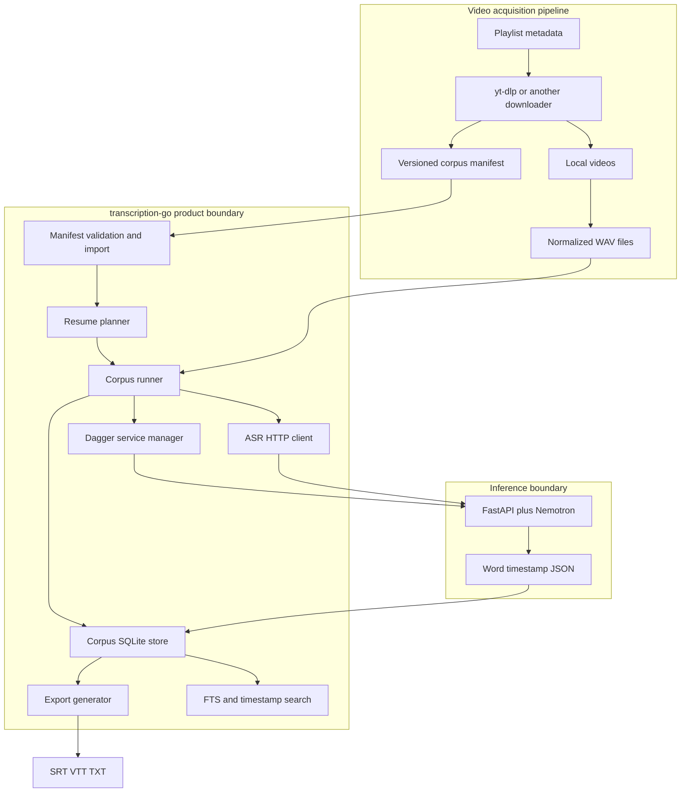
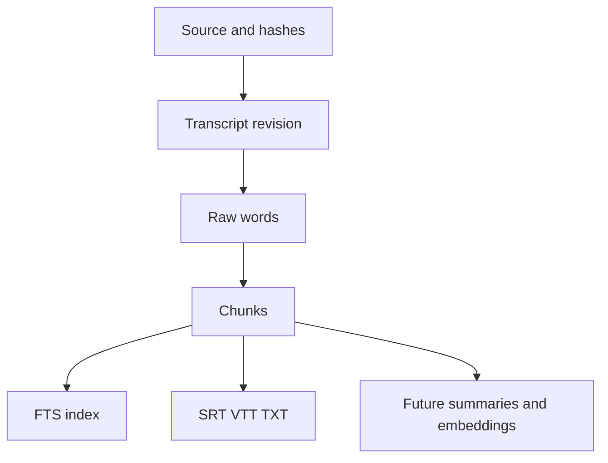
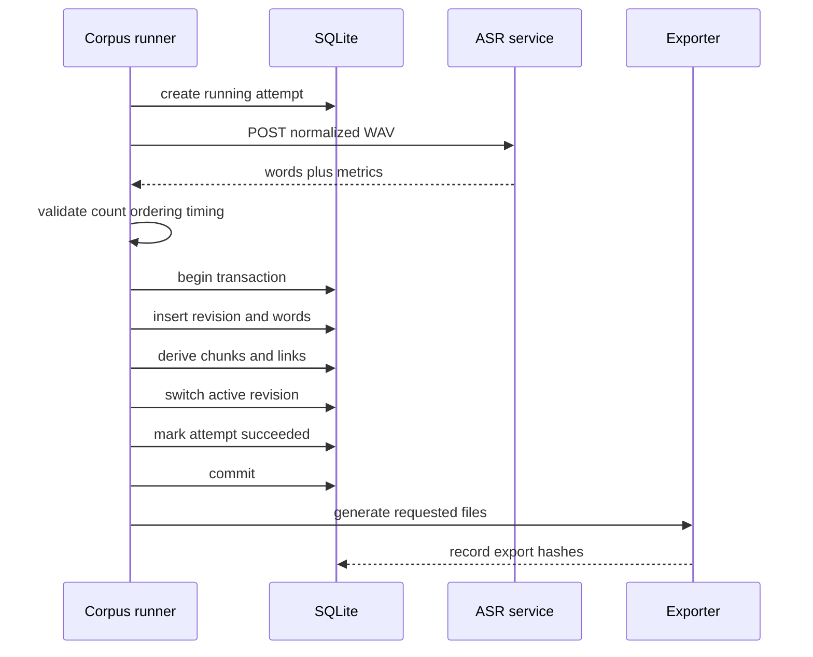

# Intern Guide: Playlist Video Corpus Transcription Architecture and Implementation

## 1. Purpose

This guide explains how to adapt `transcription-go` from a single-file transcription command into a reliable pipeline for an ordered video corpus. The immediate corpus is Richard Southwell's *Category Theory For Beginners* playlist, but the design is intentionally source-neutral. YouTube acquisition remains an upstream responsibility; this repository begins from a versioned manifest and local media/audio artifacts.

A corpus pipeline is not simply a shell loop around `transcribe batch`. A shell loop would start and stop Nemotron for every video, scatter state across directories, make failures difficult to resume, and provide no authoritative answer to questions such as:

- Which playlist entries were expected?
- Which entries were unavailable?
- Which exact media/audio bytes produced a transcript?
- Which model and decoding settings produced the words?
- Which videos completed, failed, or became stale?
- Can exports be regenerated without ASR?
- Can a search result identify a video and exact timestamp?

The adaptation adds those answers while preserving the working ASR core.

## 2. The system in one paragraph

The upstream video pipeline downloads media, records source metadata, computes hashes, and creates normalized WAV files. The new Go corpus command imports a compact manifest into SQLite, plans only the videos needing work, starts one Dagger service, and submits each audio file to the warm Nemotron model. For every successful video, Go validates word timings and atomically inserts a transcript revision, words, chunks, and provenance. SRT/VTT/TXT files are generated from committed rows. Failed attempts remain visible and retryable. Search uses derived chunks but returns the original video identity and timestamp.

## 3. Architecture boundaries



### 3.1 Upstream owns acquisition

This repository should not become a YouTube downloader. Acquisition policy changes frequently and has legal, authentication, format-selection, and rate-limit concerns that are unrelated to ASR. The upstream pipeline owns:

- playlist URL and snapshot;
- source IDs and order;
- media download and availability failures;
- media hashes and probe metadata;
- video-to-WAV extraction when needed.

The corpus command consumes a normalized manifest. An adapter can convert yt-dlp metadata into that manifest.

### 3.2 Go owns product behavior

Go owns:

- CLI and configuration;
- manifest validation;
- Dagger service lifecycle;
- source and pipeline fingerprints;
- scheduling and resume decisions;
- transcript validation;
- SQLite transactions;
- chunks, exports, status, and search;
- user-visible errors and metrics.

### 3.3 Python owns inference

Python owns only model-specific behavior:

- load Nemotron and decoding configuration;
- normalize internal inference chunks if necessary;
- run ASR;
- convert model frame offsets into seconds;
- return word records and processing metadata.

Do not move corpus state or SQLite policy into `server/server.py`. The Python process is replaceable; the corpus database is the product.

## 4. How the current code works

### 4.1 Command tree

`cmd/transcribe/root.go` builds the Cobra command tree. The current root invocation and `batch` both call `runBatch`; `live` calls the live runner. Add a new `corpus` command group here rather than overloading `batch` with manifest flags.

Proposed shape:

```text
transcribe
├── batch
├── live
└── corpus
    ├── run
    ├── status
    ├── retry
    ├── export
    └── search
```

### 4.2 Single-file batch path

`cmd/transcribe/batch.go` currently combines validation, conversion, service startup, ASR invocation, word adaptation, and output writing. It is useful executable documentation, but the corpus runner should not call `runBatch` in a loop because that would reload the model.

Refactor reusable behavior behind interfaces:

```text
CLI parsing               cmd/transcribe
corpus planning           internal/corpus
service startup           internal/server
ASR transport             internal/asr
word/chunk formatting     internal/output
corpus persistence        internal/corpus/store
```

### 4.3 Audio normalization

`internal/convert.To16kMono` is appropriate for WAV inputs and streams the conversion. The first corpus implementation should require or strongly prefer pre-normalized WAV paths in the manifest. If an audio file does not meet the contract, the runner can create a derived WAV under a controlled work directory.

Do not silently use the same output filename for every item. A stable work path should include corpus and source IDs:

```text
<work-root>/<corpus-key>/<source-id>/audio_16k_mono.wav
```

### 4.4 Warm service

`internal/server.StartDefault` and `internal/server.Start` already provide the correct Dagger lifecycle. The corpus runner must call the service factory once:

```go
service, err := factory.Start(ctx)
if err != nil { return err }
defer service.Stop()

client := asr.NewClient(service.Endpoint())
for _, item := range work {
    // reuse client and service
}
```

This is the primary performance advantage over a shell loop.

### 4.5 Full transcription endpoint

`POST /transcribe/full` handles model-level chunking inside Python and returns all words after the video finishes. This is acceptable for Phase 1. It minimizes new server work and uses a path already validated on Southwell video 019.

However, the client currently buffers the complete multipart request. Change it to stream:

```go
func uploadAudio(ctx context.Context, path string) (*http.Response, error) {
    reader, writer := io.Pipe()
    multipartWriter := multipart.NewWriter(writer)

    go func() {
        defer writer.Close()
        defer multipartWriter.Close()
        part, err := multipartWriter.CreateFormFile("file", filepath.Base(path))
        if err != nil { writer.CloseWithError(err); return }
        file, err := os.Open(path)
        if err != nil { writer.CloseWithError(err); return }
        defer file.Close()
        if _, err := io.Copy(part, file); err != nil {
            writer.CloseWithError(err)
            return
        }
        multipartWriter.WriteField("chunk_size", "60")
    }()

    request, _ := http.NewRequestWithContext(ctx, http.MethodPost, url, reader)
    request.Header.Set("Content-Type", multipartWriter.FormDataContentType())
    return client.Do(request)
}
```

Production code must propagate every goroutine and close error carefully; the sketch shows the memory model, not a copy-paste-complete implementation.

## 5. Canonical versus derived data

The most important data-model distinction is:

```text
canonical evidence:
  source manifest metadata
  media/audio hashes
  pipeline fingerprint
  raw word text and timestamps

derived projections:
  cleaned words
  chunks or sentence fragments
  FTS index
  SRT/VTT/TXT
  summaries and embeddings
```

A chunk is useful for reading and retrieval, but it can be regenerated from words. An SRT is an export. Neither should force another Nemotron run.



## 6. Corpus database model

Use one canonical `corpus.db`. It should include:

- `corpora`: corpus-level identity and manifest fingerprint;
- `videos`: every expected item, including unavailable entries;
- `transcript_attempts`: running/succeeded/failed execution history;
- `transcript_revisions`: immutable successful ASR results;
- `words`: atomic timed evidence;
- `chunks`: sentence/display/search fragments;
- `chunk_words`: exact chunk membership and order;
- `exports`: generated file provenance;
- `chunk_fts`: rebuildable full-text index.

The exact SQL contract is in `reference/01-corpus-database-and-pipeline-api-contracts.md`.

### Why revisions matter

Suppose a model update changes timing or recognition quality. Overwriting old words would destroy the ability to explain old exports. A revision preserves:

```text
video + source hash + pipeline fingerprint -> immutable word set
```

`videos.active_revision_id` chooses the current result. Old revisions can be retained, compared, or garbage-collected by explicit policy.

## 7. Resume planning

Resume behavior is based on identity, not file existence.

```text
if item unavailable:
    do not schedule ASR
else if no successful revision:
    schedule
else if audio/source hash differs:
    mark stale and schedule only with normal stale policy
else if pipeline fingerprint differs:
    mark stale and schedule
else:
    skip inference; check missing exports separately
```

Pseudocode:

```go
for _, video := range importedVideos {
    switch {
    case video.Availability != Available:
        plan.Unavailable = append(plan.Unavailable, video)
    case video.ActiveRevision == nil:
        plan.Transcribe = append(plan.Transcribe, video)
    case video.ActiveRevision.SourceHash != video.AudioHash:
        plan.Stale = append(plan.Stale, video)
    case video.ActiveRevision.PipelineFingerprint != currentFingerprint:
        plan.Stale = append(plan.Stale, video)
    case missingRequestedExports(video.ActiveRevision):
        plan.ExportOnly = append(plan.ExportOnly, video)
    default:
        plan.Unchanged = append(plan.Unchanged, video)
    }
}
```

A dry-run must print these categories before starting Dagger.

## 8. Processing one video safely

The service call is expensive and should occur outside a long SQLite transaction. The database transaction begins only after a complete result is available and validated.



### Response validation

Before database insertion:

- `word_count == len(words)`;
- all text is non-empty after trimming;
- times are finite;
- `start >= 0` and `end >= start`;
- words are nondecreasing by start time within documented overlap tolerance;
- the final word does not exceed duration by an unreasonable margin;
- ordinal assignment is deterministic;
- duplicate chunk-boundary words are handled by an explicit policy.

Never “repair” severe timestamp corruption silently. Fail the attempt with diagnostic context.

## 9. Chunk and sentence-fragment design

The earlier Nemotron pipeline used words as the base layer and chunks as the reading layer. Preserve that pattern.

A chunk record should contain:

- revision ID;
- chunk ordinal;
- first/last word ordinal;
- start/end time;
- exact joined text;
- linked word count;
- source type such as `punctuation-v1`;
- serialized policy.

Example policy:

```json
{
  "schema": "transcript-chunk-policy/v1",
  "split_on": [".", "?", "!"],
  "max_duration_seconds": 15,
  "max_characters": 120,
  "include_removed_words": false
}
```

Segment builder pseudocode:

```text
current = []
for word in ordered words:
    if current empty: segmentStart = word.start
    append word
    split = sentence punctuation
         or word.end - segmentStart >= max duration
         or rendered length >= max characters
    if split:
        emit chunk from first through current word
        current = []
if current not empty:
    emit chunk ending at final word.end
```

The last line is important: current `BuildSegments` emits `End: 0` for a trailing buffer. Fix and test this before relying on corpus exports.

## 10. CLI design

### Run

```bash
./transcribe corpus run \
  --manifest /home/manuel/Movies/richard-southwell-category-theory-for-beginners/transcription-manifest.json \
  --database /home/manuel/Movies/richard-southwell-category-theory-for-beginners/corpus-nemotron.db \
  --output-dir /home/manuel/Movies/richard-southwell-category-theory-for-beginners/transcripts \
  --format srt,vtt,txt \
  --chunk-size 60 \
  --server-dir ./server \
  --verbose
```

### Dry-run

```bash
./transcribe corpus run --manifest ... --database ... --dry-run
```

Expected summary:

```text
corpus: richard-southwell-category-theory-for-beginners
manifest items: 37
available: 36
unavailable: 1
complete and unchanged: 1
pending transcription: 35
stale: 0
export-only: 0
ASR service will start: yes
```

### Status

```bash
./transcribe corpus status --database corpus-nemotron.db
```

Status must report source completeness separately from processing completion.

### Search

```bash
./transcribe corpus search \
  --database corpus-nemotron.db \
  --query "Yoneda lemma" \
  --limit 20
```

Return title, playlist position, timestamp, excerpt, local path, and deep link.

## 11. Package design

```text
cmd/transcribe/corpus.go
  Cobra only: flags, formatting, exit status

internal/corpus/manifest.go
  JSON schema structs, normalization, validation

internal/corpus/fingerprint.go
  canonical pipeline identity and hashing

internal/corpus/store.go
  SQLite schema, import, plan, attempts, atomic commit

internal/corpus/runner.go
  service reuse, sequential work loop, cancellation

internal/corpus/chunks.go
  canonical chunk derivation or adapter to output.BuildSegments

internal/corpus/export.go
  per-video files generated from committed revisions

internal/corpus/search.go
  FTS query and timestamp result hydration
```

`internal/corpus/runner.go` should receive interfaces. Avoid calling `server.StartDefault` directly inside business logic; inject a factory from the CLI.

## 12. Phased implementation plan

### Phase 0: correctness fixes and extraction

- Fix final segment end time.
- Propagate format writer errors.
- Fix chunk word counts in legacy SQLite output.
- Extract a reusable single-file transcription function that accepts an existing ASR client.
- Add regression tests before corpus code.

### Phase 1: manifest and store

- Add manifest types and validation tests.
- Add schema migrations or an embedded schema.
- Import 37 Southwell entries, preserving one unavailable item.
- Implement fingerprint and planning queries.
- Add tests for unchanged, missing, unavailable, stale, and failed cases.

### Phase 2: warm-service runner

- Add service/transcriber interfaces.
- Start one service around the work loop.
- Process sequentially.
- Record attempt state and errors.
- Commit each revision atomically.
- Respect cancellation between items and during requests.

### Phase 3: exports and status

- Generate files from committed database rows.
- Record export hash and policy.
- Add status output and export-only repair.
- Ensure deleted exports do not trigger ASR.

### Phase 4: transport and search

- Stream multipart uploads.
- Add FTS5 maintenance and search command.
- Return source timestamps and deep links.
- Add overlap-boundary diagnostics and deduplication.

### Phase 5: full validation

- Run a short fixture through a fake transcriber.
- Run video 019 through real Nemotron.
- Interrupt a two-video run and verify resume.
- Run the full accessible Southwell corpus.
- Compare selected terms and timestamps against source captions.

## 13. Test strategy

### Unit tests

- Manifest schema and duplicate detection.
- SHA-256 and canonical fingerprint stability.
- State planner matrix.
- Word validation.
- Chunk final-buffer correctness.
- Transaction rollback on inserted-word failure.
- Export policy identity.

### Integration tests without Nemotron

Use a fake transcriber returning deterministic words:

```go
type FakeTranscriber struct {
    Results map[string]Transcription
    Errors  map[string]error
    Calls   []string
}
```

Assert:

- one service factory start;
- available items called in playlist order;
- unavailable item skipped;
- failed item recorded and next item continues;
- rerun skips completed items;
- changed hash schedules one item;
- export deletion schedules export only.

### HTTP tests

Extend `internal/asr/client_test.go` to verify streamed multipart fields and cancellation. Use `httptest.Server`; do not require Dagger.

### Real-model smoke

Use the existing short Southwell video 019. Acceptance evidence:

- service health passes;
- approximately 467 words are returned under the current model/config;
- committed database count equals response count;
- SRT/VTT final segment has a valid nonzero end;
- rerun performs no ASR call;
- model starts once for a two-item test.

## 14. Failure handling

| Failure | Required behavior |
|---|---|
| Manifest invalid | Fail before Dagger starts |
| Audio file missing | Mark source invalid/pending; do not call ASR |
| Service fails to start | No video attempt begins |
| One ASR request fails | Mark attempt failed; continue unless fail-fast |
| Database commit fails | Roll back full revision; record failure |
| Export fails | Keep transcript complete; record export error |
| Process interrupted | Running attempt becomes abandoned/retryable on next run |
| Source hash changed | Mark prior revision stale; do not pretend current |
| Members-only video | Preserve as unavailable, not failed |
| Disk full | Abort current commit/export with clear path and error |

At startup, reconcile attempts left in `running` by a dead prior process to `abandoned`. A future lease/heartbeat can make this more precise; Phase 1 can treat old running attempts as abandoned when no process coordination exists.

## 15. Performance and storage

The corpus has 36 accessible long-form videos. Expected dominant costs are:

1. model startup once;
2. ASR inference;
3. normalized WAV storage;
4. full-file upload copies;
5. export files, which are small.

Sequential warm-service processing is likely the best initial throughput. Do not add concurrency until measuring CPU utilization, memory, and model behavior. A model shared by concurrent requests may serialize internally while increasing memory and failure complexity.

Use WAL mode for status/search readers during long runs. Keep transactions short. Inference must not hold a write transaction.

## 16. Security and operational constraints

- Treat manifest paths as untrusted input: validate regular files and never execute path content.
- Do not store arbitrary environment variables, credentials, or cookies in metadata JSON.
- Keep downloaded media outside Git.
- Avoid logging transcript bodies by default; log IDs, counts, durations, and errors.
- Do not claim an unavailable video was processed.
- Pin or record model/dependency identity before treating results as reproducible.
- Ensure generated output paths remain under the requested output root; sanitize display titles and use source IDs for identity.

## 17. Alternatives considered

### Shell loop around `transcribe batch`

Rejected as the final design because it reloads the model, has no canonical corpus state, and cannot distinguish export repair from ASR work. It remains useful as a temporary smoke tool.

### One SQLite file per video only

Rejected as canonical storage because corpus search and completeness queries become filesystem orchestration problems. Per-video databases may remain export/debug artifacts.

### Put corpus behavior in Python

Rejected because it violates the established boundary and makes persistence policy depend on the model runtime.

### Parallel ASR requests

Deferred. There is no evidence they improve throughput on the current CPU model service.

### Store only sentence fragments

Rejected because fragments are editorial projections. Word timestamps provide maximum future flexibility.

### Import YouTube captions as canonical transcript

Rejected. Source captions may be useful for provisional search and validation, but Nemotron word evidence needs separate provenance.

## 18. File reference map

| File | Why the intern reads it |
|---|---|
| `cmd/transcribe/root.go` | Command registration and context propagation |
| `cmd/transcribe/batch.go` | Existing orchestration sequence and flags |
| `internal/convert/convert.go` | WAV contract and streaming resampling |
| `internal/asr/client.go` | HTTP API types and upload behavior |
| `internal/asr/client_test.go` | Transport test pattern |
| `internal/server/dagger.go` | Model service lifecycle and caches |
| `internal/server/helpers.go` | Server directory resolution |
| `server/server.py` | Model config, full/chunk/WS APIs, timestamp extraction |
| `internal/output/types.go` | Current word/filler model |
| `internal/output/format.go` | Segment and subtitle generation |
| `internal/output/sqlite.go` | Legacy word/chunk schema and compatibility |
| `internal/output/sqlite_test.go` | Existing DB assertions to extend |
| `internal/live/sqlite_sink.go` | Incremental persistence patterns, not corpus schema |
| Existing `TRANSCRIPTION-GO` ticket | Original architecture rationale and diary |
| Existing `LIVE-TRANSCRIPTION` ticket | Streaming state, timing, and operator lessons |

## 19. Definition of done

The adaptation is complete when:

- one command imports the normalized 37-entry Southwell manifest;
- 36 accessible videos are eligible and one remains explicitly unavailable;
- one Dagger/Nemotron service processes the run;
- each successful video has an immutable committed word-level revision;
- interrupted and failed work resumes without retranscribing unchanged successes;
- the corpus database supports word/chunk search with video timestamps;
- SRT/VTT/TXT exports regenerate from committed rows;
- source and pipeline fingerprints determine staleness;
- unit, integration, interruption, and real-model smoke tests pass;
- documentation and operator playbook reflect the implemented command surface.

## 20. Working rules

1. Preserve raw timed words.
2. Derive chunks and exports.
3. Start the model once per corpus run.
4. Commit one video atomically.
5. Represent unavailable source entries.
6. Resume by fingerprint, not filename.
7. Keep Python inference-only.
8. Keep the runner independent of Cobra and Dagger concrete types.
9. Make export repair cheaper than retranscription.
10. Measure before parallelizing.
