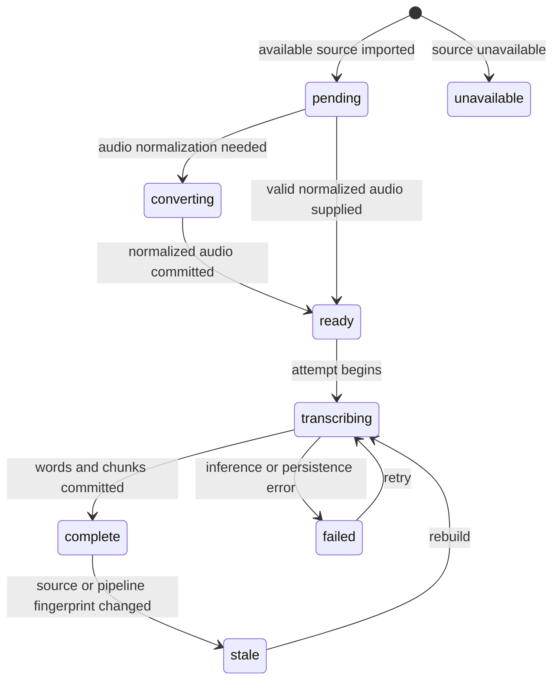

# Corpus Database and Pipeline API Contracts

## Contract hierarchy

The pipeline has four contract layers:

```text
SourceManifest/v1
  -> validated CorpusItem values
  -> Transcriber word result
  -> atomic SQLite video revision
  -> derived chunks, exports, and search views
```

Each layer has its own identity. A source video ID is not a transcript-run ID. A transcript run is not an export. Keeping these identities separate allows exports to be regenerated and ASR to be rerun without losing provenance.

## Manifest contract

The command should initially accept a normalized project-owned manifest rather than depending directly on yt-dlp's large and unstable JSON schema.

```json
{
  "schema": "transcription-video-corpus/v1",
  "corpus": {
    "id": "richard-southwell-category-theory-for-beginners",
    "title": "Category Theory For Beginners",
    "source_url": "https://www.youtube.com/playlist?list=PLCTMeyjMKRkoS699U0OJ3ymr3r01sI08l"
  },
  "items": [
    {
      "source_id": "US4Zr1WKD-8",
      "position": 1,
      "title": "Category Theory For Beginners: Introduction",
      "source_url": "https://www.youtube.com/watch?v=US4Zr1WKD-8",
      "media_path": "/home/manuel/Movies/.../001 - ... [US4Zr1WKD-8].mp4",
      "audio_path": "/home/manuel/Movies/.../audio/001 - ... [US4Zr1WKD-8].wav",
      "media_sha256": "...",
      "audio_sha256": "...",
      "duration_seconds": 3475.307,
      "availability": "available",
      "metadata": {}
    },
    {
      "source_id": "y8WC6ngApmU",
      "position": 35,
      "title": "...",
      "source_url": "https://www.youtube.com/watch?v=y8WC6ngApmU",
      "availability": "members_only",
      "metadata": {"reason": "channel membership required"}
    }
  ]
}
```

### Manifest validation

Validation must reject:

- unknown schema versions;
- missing corpus ID;
- duplicate `source_id` values;
- duplicate positive playlist positions;
- `availability=available` without `audio_path`;
- an available audio path that is not a regular file;
- malformed SHA-256 values when supplied;
- negative or non-finite duration;
- relative paths unless the CLI explicitly resolves them against a manifest root.

Validation should not reject unavailable items. They are required evidence about source completeness.

Suggested Go types:

```go
type Manifest struct {
    Schema string         `json:"schema"`
    Corpus CorpusMetadata `json:"corpus"`
    Items  []ManifestItem `json:"items"`
}

type CorpusMetadata struct {
    ID        string `json:"id"`
    Title     string `json:"title"`
    SourceURL string `json:"source_url"`
}

type ManifestItem struct {
    SourceID        string          `json:"source_id"`
    Position        int             `json:"position"`
    Title           string          `json:"title"`
    SourceURL       string          `json:"source_url"`
    MediaPath       string          `json:"media_path,omitempty"`
    AudioPath       string          `json:"audio_path,omitempty"`
    MediaSHA256     string          `json:"media_sha256,omitempty"`
    AudioSHA256     string          `json:"audio_sha256,omitempty"`
    DurationSeconds float64         `json:"duration_seconds,omitempty"`
    Availability    Availability    `json:"availability"`
    Metadata        json.RawMessage `json:"metadata,omitempty"`
}
```

The first implementation may include an adapter from the Southwell `media-manifest.json`, but the internal runner should consume only this normalized type.

## Processing state machine

A video has source availability state and transcript processing state. These must not be collapsed into one field.



Rules:

- `complete` means the current active revision matches source and pipeline fingerprints.
- An unavailable video is not failed; it was never eligible for processing.
- A process crash can leave an attempt row in `running`, but the video's active state remains the last committed revision or `pending`.
- A retry creates a new attempt. It does not overwrite historical failure data.
- Exports do not control transcript completion state.

## Pipeline fingerprint

A completed transcript must record enough identity to decide whether it is reusable:

```json
{
  "schema": "transcription-pipeline-fingerprint/v1",
  "model": "nvidia/nemotron-speech-streaming-en-0.6b",
  "model_revision": "unknown-or-pinned-revision",
  "server_requirements_sha256": "...",
  "decoding": {
    "preserve_alignments": true,
    "compute_timestamps": true,
    "segment_separators": [],
    "word_separator": " "
  },
  "chunk_size_seconds": 60,
  "chunk_overlap_seconds": 2,
  "audio_contract": "wav-pcm-s16le-mono-16000/v1",
  "word_schema": "word-timestamps/v1"
}
```

Canonical JSON should be hashed with SHA-256. Any behavior-changing setting must affect the fingerprint.

## Corpus SQLite schema

The schema below separates source metadata, attempts, committed revisions, raw words, derived chunks, and exports.

```sql
PRAGMA foreign_keys = ON;
PRAGMA journal_mode = WAL;

CREATE TABLE corpora (
    id INTEGER PRIMARY KEY,
    corpus_key TEXT NOT NULL UNIQUE,
    title TEXT NOT NULL,
    source_url TEXT,
    manifest_schema TEXT NOT NULL,
    manifest_sha256 TEXT NOT NULL,
    created_at TEXT NOT NULL DEFAULT CURRENT_TIMESTAMP,
    updated_at TEXT NOT NULL DEFAULT CURRENT_TIMESTAMP
);

CREATE TABLE videos (
    id INTEGER PRIMARY KEY,
    corpus_id INTEGER NOT NULL REFERENCES corpora(id),
    source_id TEXT NOT NULL,
    playlist_position INTEGER,
    title TEXT NOT NULL,
    source_url TEXT,
    availability TEXT NOT NULL CHECK (
      availability IN ('available','members_only','private','deleted','missing','unknown')
    ),
    media_path TEXT,
    audio_path TEXT,
    media_sha256 TEXT,
    audio_sha256 TEXT,
    duration_seconds REAL,
    metadata_json TEXT,
    processing_state TEXT NOT NULL DEFAULT 'pending' CHECK (
      processing_state IN ('pending','ready','transcribing','complete','failed','stale','unavailable')
    ),
    active_revision_id INTEGER,
    last_error TEXT,
    created_at TEXT NOT NULL DEFAULT CURRENT_TIMESTAMP,
    updated_at TEXT NOT NULL DEFAULT CURRENT_TIMESTAMP,
    UNIQUE(corpus_id, source_id),
    UNIQUE(corpus_id, playlist_position)
);

CREATE TABLE transcript_attempts (
    id INTEGER PRIMARY KEY,
    video_id INTEGER NOT NULL REFERENCES videos(id),
    attempt_number INTEGER NOT NULL,
    state TEXT NOT NULL CHECK (state IN ('running','succeeded','failed','abandoned')),
    source_sha256 TEXT NOT NULL,
    pipeline_fingerprint TEXT NOT NULL,
    started_at TEXT NOT NULL DEFAULT CURRENT_TIMESTAMP,
    finished_at TEXT,
    processing_ms INTEGER,
    server_endpoint TEXT,
    chunk_count INTEGER,
    word_count INTEGER,
    error_class TEXT,
    error_message TEXT,
    log_path TEXT,
    UNIQUE(video_id, attempt_number)
);

CREATE TABLE transcript_revisions (
    id INTEGER PRIMARY KEY,
    video_id INTEGER NOT NULL REFERENCES videos(id),
    attempt_id INTEGER NOT NULL UNIQUE REFERENCES transcript_attempts(id),
    source_sha256 TEXT NOT NULL,
    pipeline_fingerprint TEXT NOT NULL,
    model_name TEXT NOT NULL,
    duration_seconds REAL NOT NULL,
    word_count INTEGER NOT NULL,
    created_at TEXT NOT NULL DEFAULT CURRENT_TIMESTAMP,
    UNIQUE(video_id, source_sha256, pipeline_fingerprint)
);

CREATE TABLE words (
    id INTEGER PRIMARY KEY,
    revision_id INTEGER NOT NULL REFERENCES transcript_revisions(id) ON DELETE CASCADE,
    ordinal INTEGER NOT NULL,
    text TEXT NOT NULL,
    normalized_text TEXT NOT NULL,
    start_time REAL NOT NULL CHECK (start_time >= 0),
    end_time REAL NOT NULL CHECK (end_time >= start_time),
    confidence REAL,
    source_chunk_index INTEGER,
    is_filler INTEGER NOT NULL DEFAULT 0,
    is_removed INTEGER NOT NULL DEFAULT 0,
    metadata_json TEXT,
    UNIQUE(revision_id, ordinal)
);

CREATE INDEX words_revision_time ON words(revision_id, start_time, end_time);
CREATE INDEX words_normalized ON words(normalized_text);

CREATE TABLE chunks (
    id INTEGER PRIMARY KEY,
    revision_id INTEGER NOT NULL REFERENCES transcript_revisions(id) ON DELETE CASCADE,
    ordinal INTEGER NOT NULL,
    start_word_ordinal INTEGER NOT NULL,
    end_word_ordinal INTEGER NOT NULL,
    start_time REAL NOT NULL,
    end_time REAL NOT NULL,
    text TEXT NOT NULL,
    word_count INTEGER NOT NULL,
    source_type TEXT NOT NULL,
    policy_json TEXT NOT NULL,
    UNIQUE(revision_id, source_type, ordinal)
);

CREATE TABLE chunk_words (
    chunk_id INTEGER NOT NULL REFERENCES chunks(id) ON DELETE CASCADE,
    word_id INTEGER NOT NULL REFERENCES words(id) ON DELETE CASCADE,
    position INTEGER NOT NULL,
    PRIMARY KEY(chunk_id, position),
    UNIQUE(chunk_id, word_id)
);

CREATE TABLE exports (
    id INTEGER PRIMARY KEY,
    revision_id INTEGER NOT NULL REFERENCES transcript_revisions(id) ON DELETE CASCADE,
    format TEXT NOT NULL,
    policy_json TEXT NOT NULL,
    output_path TEXT NOT NULL,
    content_sha256 TEXT NOT NULL,
    created_at TEXT NOT NULL DEFAULT CURRENT_TIMESTAMP,
    UNIQUE(revision_id, format, policy_json)
);

CREATE VIRTUAL TABLE chunk_fts USING fts5(
    text,
    content='chunks',
    content_rowid='id',
    tokenize='unicode61'
);
```

After creating `videos`, add the deferred active revision foreign key at application validation time because SQLite cannot add it directly with `ALTER TABLE` in the desired form. Application code must verify `active_revision_id` belongs to the same video.

## Atomic commit protocol

Inference output must not be inserted directly into the active revision while the request is running.

```text
begin attempt row (state=running)
call ASR outside database transaction
validate response completely
begin SQLite transaction
  insert transcript_revision
  insert all words in ordinal order
  derive and insert chunks and chunk_words
  verify counts and timing invariants
  set videos.active_revision_id
  set videos.processing_state=complete
  set attempt state=succeeded and metrics
commit
emit exports from committed revision
```

If ASR fails:

```text
begin transaction
  set attempt state=failed, error class/message
  set video processing_state=failed only when no prior active revision exists
  otherwise preserve active revision and record last_error
commit
```

This protocol ensures readers see either the previous complete transcript or the new complete transcript, never a partial replacement.

## Go package contracts

### Transcriber

```go
type Transcriber interface {
    Transcribe(ctx context.Context, audioPath string, opts TranscribeOptions) (Transcription, error)
}

type TranscribeOptions struct {
    ChunkSizeSeconds int
}

type Transcription struct {
    Words           []Word
    DurationSeconds float64
    ChunkCount      int
    ProcessingTime  time.Duration
}
```

The Dagger/HTTP implementation adapts `asr.Client`. Tests use a fake.

### Service factory

```go
type Service interface {
    Endpoint() string
    Stop() error
}

type ServiceFactory interface {
    Start(ctx context.Context) (Service, error)
}
```

The runner starts one service before iterating. The corpus package should not import Dagger types.

### Store

```go
type Store interface {
    ImportManifest(ctx context.Context, manifest Manifest) error
    Plan(ctx context.Context, corpusKey string, fp Fingerprint, retryFailed bool) ([]WorkItem, error)
    BeginAttempt(ctx context.Context, item WorkItem, fp Fingerprint) (Attempt, error)
    CommitTranscript(ctx context.Context, attempt Attempt, result Transcription) (Revision, error)
    FailAttempt(ctx context.Context, attempt Attempt, err error) error
    LoadRevision(ctx context.Context, revisionID int64) (RevisionData, error)
}
```

### Exporter

```go
type Exporter interface {
    Export(ctx context.Context, video Video, revision RevisionData, formats []string) ([]Export, error)
}
```

Export failure does not invalidate the committed transcript. It is reported separately and can be retried without inference.

## Runner pseudocode

```go
func RunCorpus(ctx context.Context, cfg Config) error {
    manifest := DecodeAndValidate(cfg.ManifestPath)
    store := OpenStore(cfg.DatabasePath)
    store.ImportManifest(ctx, manifest)

    work := store.Plan(ctx, manifest.Corpus.ID, cfg.Fingerprint, cfg.RetryFailed)
    if cfg.DryRun {
        return PrintPlan(work)
    }
    if len(work) == 0 {
        return nil
    }

    service := cfg.ServiceFactory.Start(ctx)
    defer service.Stop()
    transcriber := NewHTTPTranscriber(service.Endpoint())

    var failures []error
    for _, item := range work {
        if err := ctx.Err(); err != nil { return err }
        attempt := store.BeginAttempt(ctx, item, cfg.Fingerprint)
        result, err := transcriber.Transcribe(ctx, item.AudioPath, cfg.Transcribe)
        if err != nil {
            store.FailAttempt(ctx, attempt, err)
            failures = append(failures, err)
            if cfg.FailFast { break }
            continue
        }
        revision, err := store.CommitTranscript(ctx, attempt, result)
        if err != nil {
            store.FailAttempt(ctx, attempt, err)
            failures = append(failures, err)
            if cfg.FailFast { break }
            continue
        }
        if _, err := cfg.Exporter.Export(ctx, item.Video, store.LoadRevision(ctx, revision.ID), cfg.Formats); err != nil {
            failures = append(failures, err)
        }
    }
    return errors.Join(failures...)
}
```

## CLI contract

Proposed command:

```text
transcribe corpus run
  --manifest PATH             required
  --database PATH             default: <manifest-dir>/corpus.db
  --output-dir PATH           default: <manifest-dir>/transcripts
  --format srt,vtt,txt        export formats
  --chunk-size 60
  --server-dir PATH
  --retry-failed
  --force-stale
  --fail-fast
  --dry-run
  --verbose
```

Additional commands:

```text
transcribe corpus status --database PATH
transcribe corpus retry --database PATH --source-id ID...
transcribe corpus export --database PATH --source-id ID... --format srt,vtt,txt
transcribe corpus search --database PATH --query TEXT --limit 20
```

`run --dry-run` must not start Dagger or alter transcript state. Manifest import may be separated into `corpus import` if strict no-write dry-run semantics are desired.

## Search result contract

```json
{
  "source_id": "US4Zr1WKD-8",
  "playlist_position": 1,
  "title": "Category Theory For Beginners: Introduction",
  "start_time": 742.48,
  "end_time": 754.12,
  "text": "... functor ...",
  "source_url": "https://www.youtube.com/watch?v=US4Zr1WKD-8&t=742",
  "local_media_path": "/home/manuel/Movies/...mp4",
  "revision_id": 123,
  "pipeline_fingerprint": "sha256:..."
}
```

The result cites raw transcript timing. Future summaries or embeddings may retrieve a chunk, but the final result must hydrate the original chunk and video timestamp.

## Required invariants and test assertions

- Word ordinals are contiguous from zero within a revision.
- Words are ordered by start time; small overlap tolerance must be explicit.
- Every word end is at or after its start.
- Every chunk references at least one word.
- Chunk start/end equals the first/last linked word timing.
- Chunk `word_count` equals linked row count.
- Committed revision `word_count` equals inserted row count.
- Active revision belongs to the same video.
- A complete video with unchanged source and pipeline fingerprint is not scheduled.
- A changed source hash or pipeline fingerprint becomes stale.
- Export deletion does not schedule ASR; it schedules export regeneration.
- Unavailable videos remain visible in status and completeness totals.
